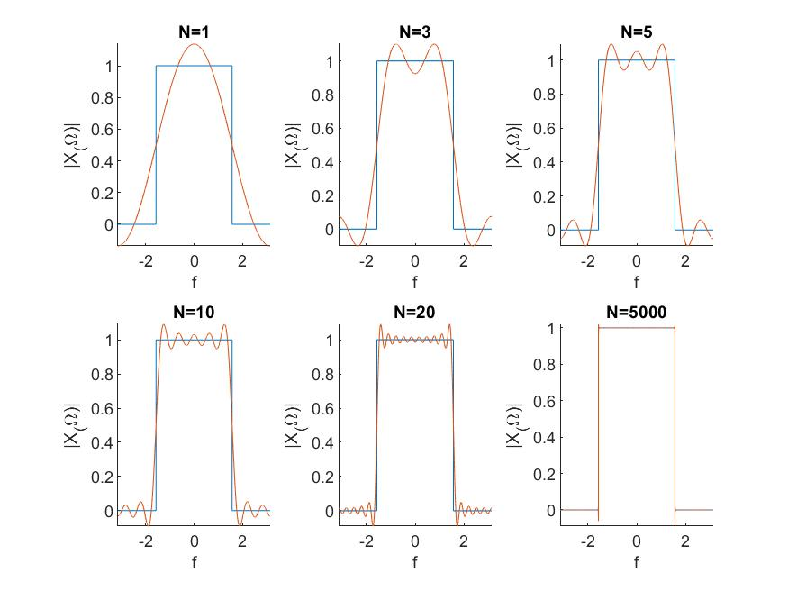

---
documentclass:
- article
geometry:
- top=1in
- left=1in
---

# ECE113 Homework 4 MATLAB Portion

This seciton shows the MATLAB code and results for question 1C of homework 4. Each section is broken down below:

## MATLAB Code

The following code is used to generate the the approximation of $X(\Omega)$ using sucessively larger summations.

```MATLAB
%% ECE113 Homework 4
% Author: Thomas Kost
% date: 4/26/20
%%%%%%%%%%%%%%%%%%%%%%%%%%%%%%%%%%%%%%%%%%%%%%%%%%%%%%%%%%%%%%%%%5
clear, clc,close all;
%% 1C:
% approximating X(w) numerically

N = [1 3 5 10 20 50];
w_c = pi/2;
df = 0.001;
freq = [-pi :df: pi];
X_w = abs(freq)<=pi/2;
fig1 = figure(1);


for i= 1:length(N)
    
X_w_approx = zeros(1,length(freq));
X_w_approx = X_w_approx + w_c/pi; %take care of 0th index

    for n = -N(i):N(i)
        if (~n)
            continue;
        else
            X_w_approx = X_w_approx+ (sin(w_c*n)/(pi*n))*exp(-1i*freq*n);
        end
    end
    
    subplot(2,3,i);
    hold on;
    plot(freq, X_w);
    plot(freq, real(X_w_approx));
    hold off;
    xlabel('f');ylabel('|X_(\Omega)|');
    title(['N=',num2str(N(i))]);
        
end
saveas(fig1,'dtft_approx.jpeg');
```

## Results

Figure 1 shows the results of our approximation of $$X(\Omega)$$. We can notice that as N increases, the approximation of our fourier transform approaches that of the ideal transform. It should be noted that the blue rec() function plotted is our ideal fourier transform. The orange oscillation functions of each plot are the approximations for each size of N. We can see Gibbs phenomena in these plots.


