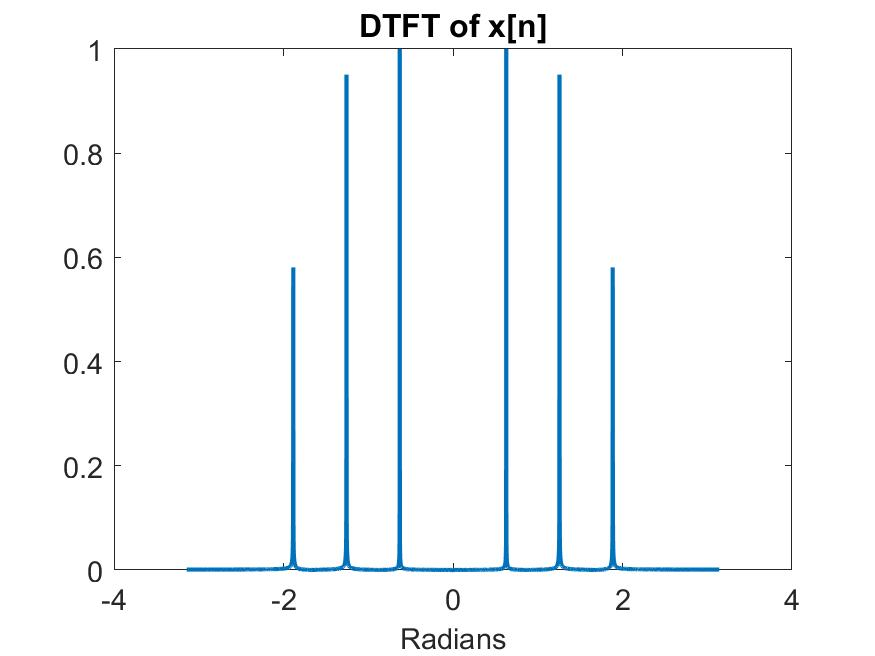
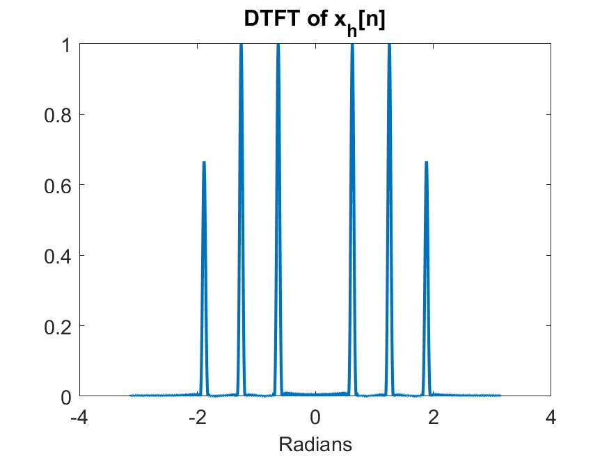

---
documentclass:
- article
geometry:
- top=1in
- left=1in
---

# MATLAB Portion of Homework 5

Note that this document is broken into two parts--one section for the code and one section for the results and discussion.

## Code

The following code was used to generate the plots for problem 5. Note that the code is labeled by section. 

```MATLAB
%% ECE113: Homework 5
% Author: Thomas Kost
% Date: 5/7/2020
%%%%%%%%%%%%%%%%%%%%%%%%%%%%%%%%%%%%%%%%%%%%%%%%%%%%%%%%%%%%%%%%%%%%%%%%%%
clc, clear, close all;
%% 5:
% create signal
fs = 100; %sampling frequency
t = 0:1/fs:50;%time axis
x = 2*sin(2*pi*30*t)+ 3*sin(2*pi*20*(t-2))+3*sin(2*pi*10*(t-4));%signal
N = length(x);

%A:
omega = 2*pi*(0:N-1)/N;
omega = fftshift(omega);
omega = unwrap(omega-2*pi);
X = fft(x,N); %compute N point of DFT of x
X = X/max(X);%rescale
fig1 = figure(1);
plot(omega,abs(fftshift(X)), 'LineWidth', 2);
title('DTFT of x[n]', 'fontsize', 14);
set(gca, 'fontsize', 14);
xlabel('Radians', 'fontsize', 14);
saveas(fig1, '5_a.jpg');
%B
w_r = t<=2;
x_r = x.*w_r;
X_r = fft(x_r,N);
X_r = X_r/max(X_r);

fig2 = figure(2);
plot(omega,abs(fftshift(X_r)), 'LineWidth', 2);
title('DTFT of x_r[n]', 'fontsize', 14);
set(gca, 'fontsize', 14);
xlabel('Radians', 'fontsize', 14);
saveas(fig2, '5_b.jpg');
%C
w_h = hamming(sum(w_r));
w_h = [w_h',zeros(1,N-length(w_h))];
x_h = w_h.*x;
X_h = fft(x_h,N);
X_h = X_h/max(X_h);

fig3 = figure(3);
plot(omega,abs(fftshift(X_h)), 'LineWidth', 2);
title('DTFT of x_h[n]', 'fontsize', 14);
set(gca, 'fontsize', 14);
xlabel('Radians', 'fontsize', 14);
saveas(fig3, '5_c.jpg');
```

## Results

### 5A

We can see the results of the provided code on plotting a close approximation of the DTFT for the provided signal. This plot is shown in Figure 1.



### 5B

We can see the results of using a rectangular window on the provided signal in Figure 2.


### 5C

We can see the results of using a hamming window on the frequency of the provided signal in Figure 3.



### 5D

We can see that both the hamming windowed signal and the rectangular windowed signal distorted the original siganl's spectrum. However, each window affects the spectrum differently. Visually we can see that the spectrum of the rectangularly windowed signal shows much more leakage. That is, the sharp peaks present in the original signal begin to spread out. The energy from the signal is now no longer conly concentrated at the original frequency. We can see too that while the hamming window also shows this same issue, it is much less pronounced. We can see that the smoother nature of the hamming window allows for the spectrum of a windowed signal to be much better preserved.
