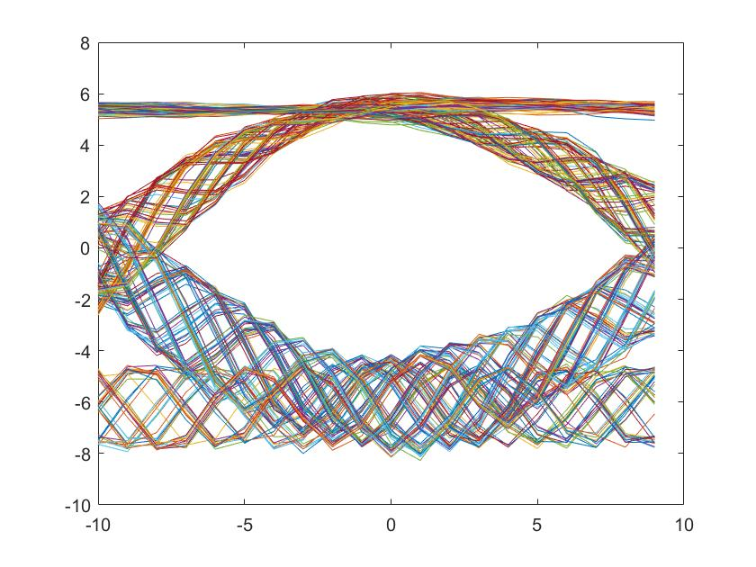

---
documentclass:
- article
geometry:
- top=1in
- left=1in
---

# ECE132A Final Report: APRS Digital Packet Radio

$$\text{Thomas Kost}$$
$$UID:504989794$$

# Introduction:

This project involved using the RTL-SDR hardware to recieve signals from the Automatic Packett Reporting System. The radio network is active throughout most of LA and the Bay area. However, upon attempting to recieve a signal at the designated 144.39 MHz, I had difficulty getting an adequite recording. I tried on a few different days with  similar results. Very small pulses could be seen on the spectrogram, but when the recording was examined, the SNR was far too low to get a discernable signal. As a result the bulk of the project was centered around using the provided files ('aprs23.dat' and 'aprs22.dat'). Each section will contain an explanation of the task performed and the code associated with the task.

# Part 1: Transforming APRS RF Signals into Bits

The first part of this project was to record data at 144.39 MHz and find a packet. This step, as mentioned previously, was done several times on several days--however, none of the signals resulted in an SNR good enough to result in a readable packett. The recording was carried out through the following command line prompt:

```CMD
> cd C:\Users\Tommy\Desktop\SDR_RTL\rtlsdr_win\rtlsdr_win\x32
> rtl_sdr -f 144390000 -n 41920000 -g 30 aprs.dat

```

We then used the following MATLAB lines to decimate and visualize the signal captured in out data file. This decreases the number of samples to a managable amount. 

```MATLAB
>data  = loadFile('aprs22.dat');
>dd    = decimate(decimate(data,8,'fir'),8,'fir');
>dd(1) = 0;
>plot(abs(dd));
```

Visualizing the file (for aprs22.dat) resulted in the the plot shown in Figure 1. 


We then extract the signal itself. This is done through finding the indexes on either of side of the signal. This can be done manually through observing the image in Figure 1, or through the code below (which is detailed later):

```MATLAB

>[boundaries,m] = identify_message(dd);
>% message boundaries have been found
>for k =1:m
>    lower = boundaries(k,1);
>    upper = boundaries(k,2);
>    dp    = dd(lower:upper);
>    dp  = dp-sum(dp)/length(dp);
```

The loop above will contain all code that is discussed later. This is used to loop through multiple messages if they are present in the recording. Additionally, the last line of the above code, removes the DC bias of the signal.

We now downsample our signal to be at 24 kHz and use narrowband FM decoding to break out signal up into two different frequencies. This is done in the follwoing lines. We can see the visualizaiton of the our signal at this point in Figure 2--where there are clearly two resolved signals.

```MATLAB
>    dps = resample(dp,3,4);
>    dpf = angle(conj(dps(1:end-1)).*dps(2:end));
>    plot(dpf(500:2500))
```


## Non-synchronous Detection

We now use a non-synchronous detection scheme to resolve the frequency shift keyed signal into an amplitude shift keyed signal. This is done through generating a matched filter for both the 1200Hz and 2200Hz components of our signals. We then convolve each of these matched filters with the signal--this will produce peaks where the signal resonates with the filter (as they are identical). We then subtract the convolved signals from onea another resulting in an improved noise perfomance. This additionally centers the bits around zero--giving zero bits a negaitve value and a 1 bit a positive value. The code for this process is shown below:

```MATLAB

>t20 = [-10:9]/20;
>mf1200 = exp(i*2*pi*t20*1.0);
>mf2200 = exp(i*2*pi*t20*1.8);
>
>d12 = conv(dpf,mf1200,'same');
>d22 = conv(dpf,mf2200,'same');
>ddif = abs(d12)-abs(d22);
```

We can plot the resulting signal, this is shown in Figure 3.


## Timing Extraction

We can now find the timing of our bits. This is done through producing an eye diagram out of signal fragments of 20 samples long (length of a bit). We plot our eye diagram and find the needed offset to center our sampling in the middle of each bit. This gives us the best chance of garunteeing that our signal is sampled in the correct location. Once we have found our offset, we can then convert our signal into a bitstream through examining every 20 samples shifted by our offset and apploying a boolean expression. The eye diagrams showing the result of shifting our signal are shown in Figure 4 and Figure 5. The code implementing this section is shown below. Note that the centering process has a custom function that will be discussed in a later section.

```MATLAB

>offset = center_eye(ddif);
>bts = ddif((offset+1:20:end)-offset)>0;
```




# Decoding APRS Packets

At this point we have a bitstream, and so we can now implement the decoding of the APRS packets. This is done in several steps, which mimic the pattern in which the APRS packets are generated from binary data. 

## Line Encoding

The APRS packetts are encoded in a non-return to zero, inverted (NRZI) line encoding. As a result, we need a decoder undo this line encoding. This is implemented in the decode_NRZI.m file, shown below. This function is implemented through looping through the bitstream provided and returning the logical exlusive or between the current bit and the previous bit.

```MATLAB

%% Decode NRZI
%  Author: Thomas Kost
%  UID: 504989794
%  Date: 6/3/20
%%%%%%%%%%%%%%%%%%%%%%%%%%%%%%%%%%%%%%%%%%%%%%%%%%%%%%%%%%%%%%%%%%%%%%%%%%%

function [db] = decode_NRZI(bit_stream)
%note that coming in we have a bit stream where each bit takes up only a
%single index
starting_condition = 0;
bitstream = [starting_condition bit_stream']';
len = length(bitstream);
db = zeros(len-1,1);
for i= 2: len;
    db(i-1) = ~xor(bitstream(i),bitstream(i-1));
end
end
```

## Synchronization

APRS packets are framed with bytes of the following form :[ 0 1 1 1 1 1 1 0 ]. These bytes are placed adjacently to one another, this gives us a clue as to where to start reading data. As a result, we can search for this bit pattern, and when these special bytes no longer appear, we know this is the beggining of the data. This is the idea that is implemented in the frame)byte_sync function. Its implemnataion is show below:

```MATLAB
%% Fame_byte_sync
%  Author: Thomas Kost
%  UID: 504989794
%  Date: 6/4/20
%%%%%%%%%%%%%%%%%%%%%%%%%%%%%%%%%%%%%%%%%%%%%%%%%%%%%%%%%%%%%%%%%%%%%%%%%%

function [dbs] = frame_byte_sync( db )
% Take a packet that has been NRZI decoded, and synchronize to the frame bytes
% Find the first frame byte
% Skip over all of the following frame bytes
% Return the bit stream following the last frame bytes

fb = [0 1 1 1 1 1 1 0]';
last_index =0;
for kk=1:(length(db)-7)
if (sum(~xor(db(kk:kk+7), fb)) == 8)
    if(kk-last_index <= 8 || last_index ==0),
        last_index = kk;
    end
end
end
dbs = db(last_index+8:end);
end
```

## Bit Stuffing

Another aspect to the APRS encoding is the use of bit stuffing. The APRS standard limits the number of consecutive 1's to 5. As a result, in the encoding process a 0 bit is "stuffed" after every five consecuting 1 bits. As a result, we can undo this through removing the zero after each 5 consecutive ones. This is done through convolving our bitstream with 5 ones, and making a distinction between our end bytes (that contain 6 ones consecutively) and all points where a bit was stuffed. This is implemented in de_bit_stuff.m, which is shown below:

```MATLAB

%% de_bit_stuff
%  Author: Thomas Kost
%  UID: 504989794
%  Date: 6/4/20
%%%%%%%%%%%%%%%%%%%%%%%%%%%%%%%%%%%%%%%%%%%%%%%%%%%%%%%%%%%%%%%%%%%%%%%%%%
% dbs = [0 1 0 1 1 1 1 1 0 1 0 0 0  1 1 1 1 1 0 1 1 1 1 1 0 0 0 1 1 1 1 1 1 0 0 1 1 1 1 1 1 0 1];
% 
% x = de_bit_stuff1(dbs);
% fprintf('%i', x);
function [ dbsd ] = de_bit_stuff( dbs )
%
% Take a bit stuffed sequence of bits, and eliminate the stuffed zero bits
%
x = conv(dbs,ones(1,5), 'full');
%plot(x);
i = x==5;
i= find(i);
end_msg=0;
for j=1:length(i)-1
    if(i(j)+1==i(j+1) && end_msg == 0)
        end_msg =j;
    end
end
i = i(1:end_msg);
dbs(i+1)=[];
dbsd=dbs(1:i(end_msg)-length(i)-5);
end
```

## Bits to Character

Our last function needed is our bits_to_char function. This function takes in a byte in binary digits, and outputs the decoded character in ASCII text. This allows us to convert our binary data to text, making our message human readable. This implementation is shown below:

```MATLAB

%% bits_to_char
%  Author: Thomas Kost
%  UID: 504989794
%  Date: 6/4/20
%%%%%%%%%%%%%%%%%%%%%%%%%%%%%%%%%%%%%%%%%%%%%%%%%%%%%%%%%%%%%%%%%%%%%%%%%%

function [ cs ] = bits_to_char( b )
%
% Take a bit stream and convert it to ascii characters
%
    bv = b(1)*1 + b(2)*2 + b(3)*4 + b(4)*8 + b(5)*16 + b(6)*32 + b(7)*64 + b(8)*128;
    cs = char(bv);
end
```

At this point we have fully implemented all the necessary parts to decode the bitstream we generated. The results of the decoded messages from the aprs23.dat and aprs22.dat are shown below:

$$\text{|S7UUXX0|KD7OIR~|K7FED q|N6ZX  s|WIDE2 p|:`1*!l]xu/]"3z\}="`} $$

$$\text{|:×UN—j|APT3110|KMEP1 0|N6ZX  s|WIDE1 p|WIDE2 1|:/251952z3726.80Nᒐ.18Wv001/000/A=001942/N6ZX,}$$
$$\text{ Kings Mt. Eme\&} $$

This was produced by the following two lines of code:

```MATLAB


text = aprs_decode(bts);
fprintf(text);
```


# Further Automation

The following functions are used to automate the process of discerning different messages in our signals. 

## Identify Message

The purpose of this function is to fins the approximate beginning and end of each signal. This is based upon a statistical method, where we determine which points are 1 standard deviation above the mean of the signal. We then filter the signal to remove single points that are sources of error (as for our message, all points must lie above the mean). This is used to determine the start and end of each message and the number of messages in our recording. Note too that a buffer is also added to ensure that the entire message is found. The implementation is shown below:

```MATLAB

%% identify_message
%  Author: Thomas Kost
%  UID: 504989794
%  Date: 6/4/20
%%%%%%%%%%%%%%%%%%%%%%%%%%%%%%%%%%%%%%%%%%%%%%%%%%%%%%%%%%%%%%%%%%%%%%%%%%
function [indicies, messages] = identify_message(data)

m = mean(abs(data));
s = std(abs(data));
threshold = abs(data)>(m+s);
threshold = conv(threshold,ones(100,1))==100;
d_threshold = circshift(threshold,1);
x = d_threshold ~= threshold;
index =find(x);

indicies =reshape(index, 2,length(index)/2)';
indicies(:,1)= indicies(:,1)-400;
indicies(:,2)= indicies(:,2)+400;
messages = size(indicies,1);
end
```

## Center Eye

This function is used to find our offset value--allowing us to automatically center our samples to be in the middle of each bit. This is done through breaking a middle subsection of our signal into 20 sample long segments. We then discretize these samples into integer values. We then find the average position of a zero crossing and use that value to calculate the appropriate offset (as our zero crossing should be at 10). The implementation of this is shown below, we were able to produce the proper offset values for both aprs23.dat and aprs22.dat. The implementation of this function is shown below:

```MATLAB

%% center_eye
%  Author: Thomas Kost
%  UID: 504989794
%  Date: 6/6/20
%%%%%%%%%%%%%%%%%%%%%%%%%%%%%%%%%%%%%%%%%%%%%%%%%%%%%%%%%%%%%%%%%%%%%%%%%%

function [offset] = center_eye(ddif)
len = length(ddif);
n1 = ceil(len/2)-mod(ceil(len/2),20);
n2 = n1 + 20*256 - 1;
 
boff = [-10:9];
eyed = reshape(ddif((n1:n2)-10),20,256);
fl = floor(eyed);
cl = ceil(eyed);
z_fl =fl==0;
z_cl = cl==0;
x = sum(z_cl,2) +sum(z_fl,2);
x= x-min(x);
figure(3);
plot(boff,x);
figure(4);
plot(boff,eyed);

cross_pt = floor(x'*boff'/sum(x));%get average value
offset = 10-(cross_pt);
end
```

# Known Bugs

These functions allow us to automatically decode the messages contained in a recording. However, there are still a few known issues. One main issue is that the program occasionally has difficulty finding the start of a message. I am currently in the process of debugging it further, but on aprs23.dat there is some difficulty in detercing the framing bits. I think this is likely due to an issue with the size of the signal and the size of the samples used in the generating of the eye diagram. As a result, the offset, while still producing an acceptable eye diagram seems to no longer produce a bit stream with the framing bits intact.
Additionally, while I assume the messages are being decoded properly as we are seeing whole words, as I am unfamiliar with the syntax of the data going in, I cannot validate that the signal is decoded exactly perfectly. However, we suspect that the signal is accurate based on the systematic and logical contents.

# Conclusion

In this project we were able to carry out the demodulation and decoding of an APRS message. This was carried out through applying matched filtering, and several line encoding bit manipulations to return ASCII text. We also began the process of automating our process of decoding, allowing messages to be decoded into text without the need for determining offsets and indicies by hand. 
One futher direction I am interested in taking this project is to begin employing the RTL_SDR Radio package in MATLAB. My goal here would be to regularly record files, and produce the message in a semi-live manner. Taking these live recordings and decoding the messages found in them in a single file would be the ultimate goal--able to recieve and immediately decode files. 
