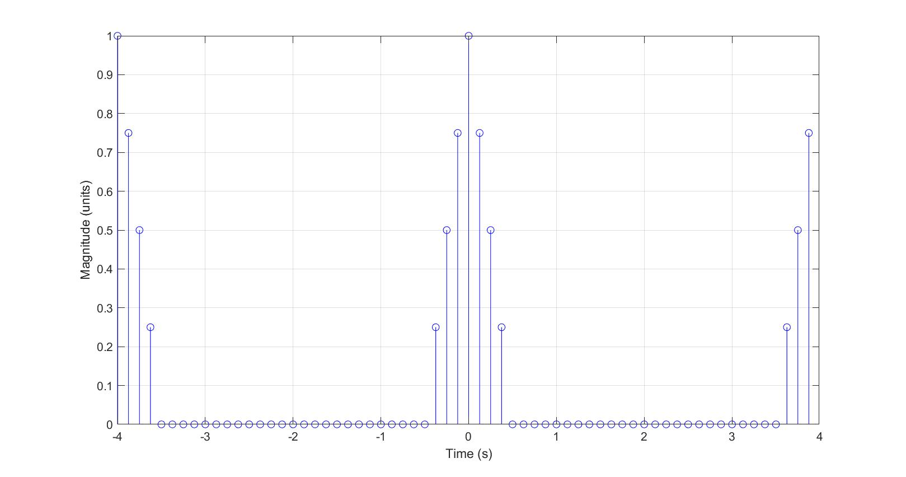
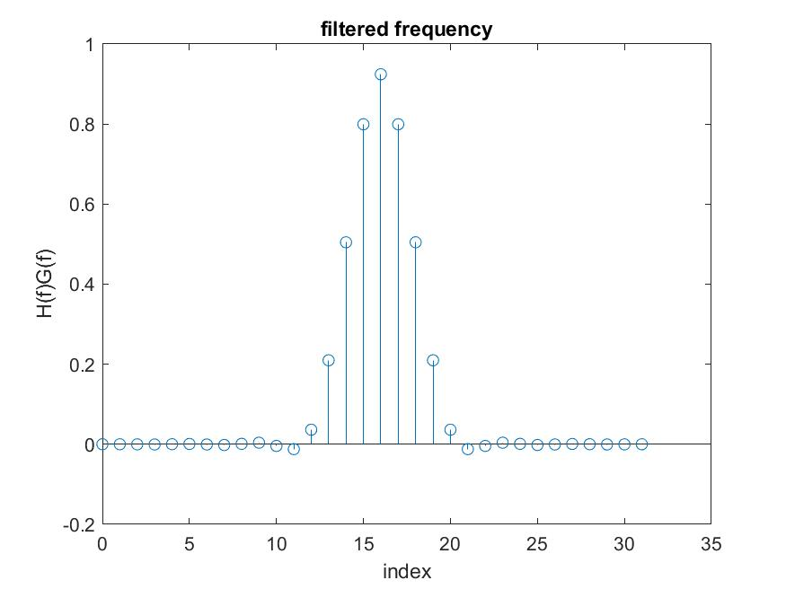
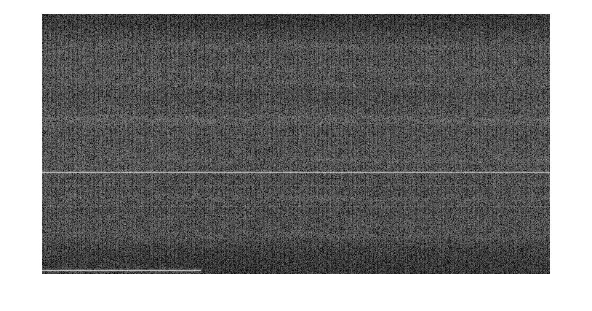
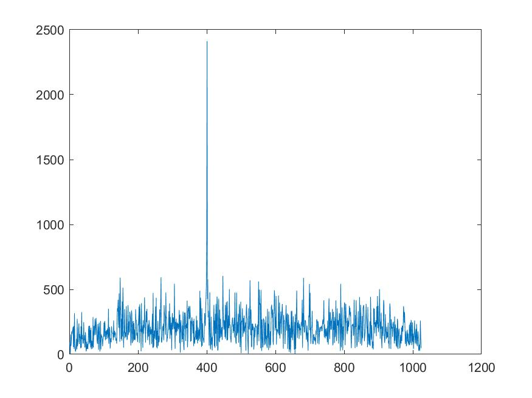

---
documentclass:
- article
geometry:
- top=1in
- left=1in
---  
# MATLAB Assignment 2:
$$ \text{ Author: Thomas Kost UID: 504989794}$$
Note that the computer assignment had two distinct parts to it. As a result this report will be broken into two parts--one for the textbook problem involving filtering in the frequency domain and one for the lab portion.

## Textbook Problem 3.10-3

### Code

This section will show the code used to generate the results of Textbook Problem 3.10-3. Note that the code is largely based on the textbook example which we were supposed to model the code after. As a result many of the variable names and methods remain consistent between the two.

```MATLAB

%% ECE132A: Computer Assignment 2
%Author : Thomas Kost
%Date : 4/14/20

%% 3.10-3
clear; clc; clf; hold off; clear;
%generate triangle wave
tau = 1;
B  = 4/tau;
Ts = 1/(2*B);
T0 = 4*tau;
N0 = T0/Ts;
k = 0:N0-1; 
fsamp = (0:4*N0)/(4*N0*Ts)-B;
gtd = zeros(1, N0);
A = 1;
Tmid = ceil(N0/2);
for i = 1:Tmid+1
    gtd(i) = (1-2*(i-1)*Ts)*rectangularPulse(-0.5,0.5,(i-1)*Ts);
end
%tedge = round(tau/(2*Ts));
%if abs(tau-tedge*2*Ts) < 1.e-13
%    gtd(tedge+1) = A/2;
%end
gtd(N0:-1:N0-Tmid+2) = gtd(2:Tmid);
tvec = k*Ts;
fvec = k/(N0*Ts)-B;
Gq = real(fftshift(fft(Ts*gtd)));
fig1 = figure(1);
stem([tvec-T0 tvec], [gtd gtd], 'b');
xlabel('Time (s)');
ylabel('Magnitude (units)');
grid;
saveas(fig1, 'time_domain_input.jpg');

fig2 = figure(2);
stem(fvec,Gq,'b:');
xlabel('Frequency (1/s)');
ylabel('Magnitude (units)');
grid;
saveas(fig2, 'fourier_input.jpg');
%now transform and filter
q = 0:N0-1;
fcutoff = 2/tau;
fs = 1/(N0*Ts);
qcutoff = ceil(fcutoff/fs);
Hq(1:Tmid+1)=0;
Hq(1:qcutoff)=1;
Hq(qcutoff+1)=0.5;
Hq(N0:-1:N0-Tmid+2) = Hq(2:Tmid);
Yq = (Gq).*fftshift(Hq);
yk = ifft(fftshift(Yq))/Ts;
fig3 = figure(3);
stem(k, fftshift(yk));
title ('filtered frequency');
xlabel( 'index')
ylabel('H(f)G(f)');
saveas(fig3, 'filtered_frequency.jpg');

gtshift = fftshift(gtd);
hk = fftshift(ifft(Hq));
ykconv = conv(gtshift, hk);
ykpad = [zeros(1,N0/2) fftshift(yk) zeros(1,N0/2)];
fig4 = figure(4); hold off; 
tvec2 = Ts*[1:2*N0-1];
subplot(311);
stem(fvec,Gq, 'b');grid;
title('Input Frequency Response');
xlabel('f Hz');
ylabel('G(f)');
subplot(312);
stem(fvec,fftshift(Hq), 'b'); grid;
title('Lowpass Filter Gain');
xlabel('f Hz')
ylabel('H(f)');
subplot(313);
stem(tvec2,ykconv,'b'); grid;
title('Lowpass filter output');
xlabel(' t sec');
ylabel('y(t)');
saveas(fig4,'filter_results.jpg');
```

### Results

We were able to find a few distinct results in the process of solving this problem. In the solving of our problem, we had to first generate the appropriate periodic triangle wave with $/tau = 1$ and ensure that the proper fourier transform of the function was also generated. The plots of these functions can be seen in Figure 1 and Figure 2. As we can see the triangle waveform appears exactly as it is specified. Note that the period with which the wave occurs follows that of the example for C3.4. Additionally, we can note that the fourier transform is a squared sinc function--which is what we would expect given the time domain waveform. Having these results, we can move on to filtering. 




Again, for the filtering we followed the lead of the provided example. This suggested to create a cutoff frequency of $/frac{2}{/tau}$. In doing so we were able to create an ideal filter shown the middle plot of Figure 3. We can see that the ideal low pass filter allows only frequecnies below 2 hertz and completely rejects all other frequencies. As we can see in comparing the initial fourier transform shown at the top of Figure 3 and the filtered Fourier Transform (in Figure 4) the plots are largely the same. However, all higher frequencies in our filtered plot are zeroed out. As a result, we are still working with the majority of the energy of our original signal. We then create the corresponding output of our filter using the inverse tranform of our filter convolved with our input. We can see that while we do not return exactly the same waveform, our output (seen at the bottom of Figure 3) is remarkably similar to our input. This suggests that we can remove higher frequencies if they do not contribute much to a signal with minimal effect on the output of the signal. This is supported by Parseval's theroem which  suggests that the energy of a signal can also be seen in its frequency spectrum. As a reuslt, if we do not remove a large area from under the curve of our frequency spectrum, our impact on the signal should also be minimal. 




## RF Lab

### Code

This section will show the code used to generate the results for our RF Lab portion of this assignment. Note that as I have not yet recieved the hardware, I will be completing this portion of the assignment using the provided data file. The code used is as follows:

```MATLAB

%% ECE132A: Computer Assignment 2
%Author : Thomas Kost
%Date : 4/14/20

clear,clc;
%% Find and Display Signals
data = loadFile('ab1355_10s.dat');
n_scale = 2048000;
n0 = 5*n_scale;
frequency = 2000;
block_size = n_scale/frequency;
ds = msg(data,n0,block_size, 2000)
figure(3);
plot(abs(ds(:,1000)));

% we looked at time starting at 5 seconds
%we notice another signal, so plotting this we find a peak at line 401


figure(4);
plot(abs(ds(401,:)));
xlabel('Time (s)');
ylabel('Amplitude (units)');
```

### Results

We achieved a few results in the process of completing this lab. First, we scanned through the provided wavefile generating spectrum plots and looking for a signal to appear. In starting from the 5 second mark in our data with a sampling rate of 2000, we were able to find a signal. This appeared in the spectrum plot--this is shown in Figure 5.



After we determined that there was a signal to be found, we plotted the magnitude of the spectrum. This resulted in the plot shown in Figure 6. This plot shows a very sharp peak at index 401. This means that this row of the spectrum object will contain the signal that we are trying to find. 



We then plot the row that our peak indicated. This resulted in Figure 7. This signal is very clearly an amplitude modulated signal with a constant bias. This signal actually looks quite regular and possibly reminiscent of an audio recording. This gives us great confidince that we are investigating a proper singal, and not simply an anomoly due to noise.


