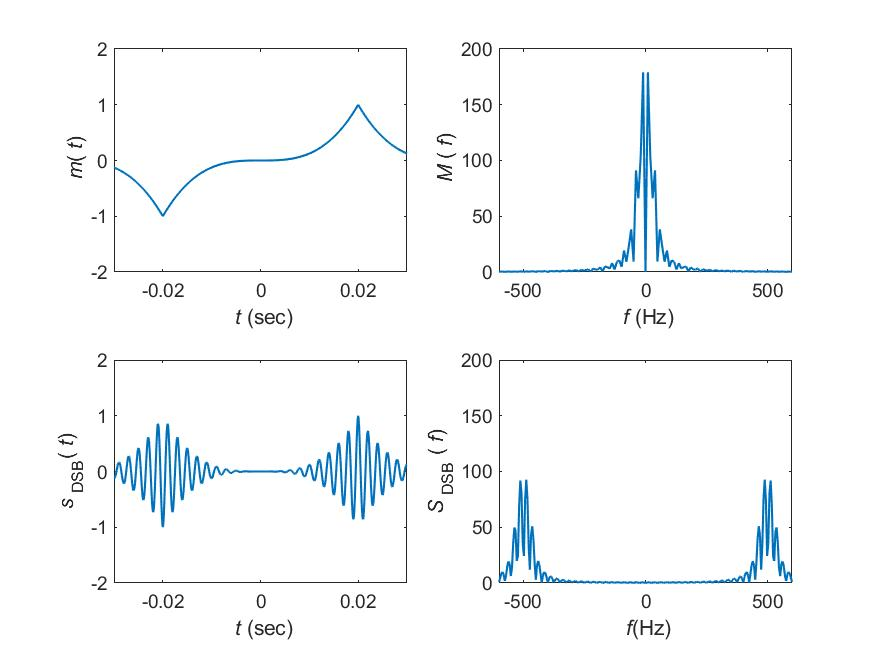
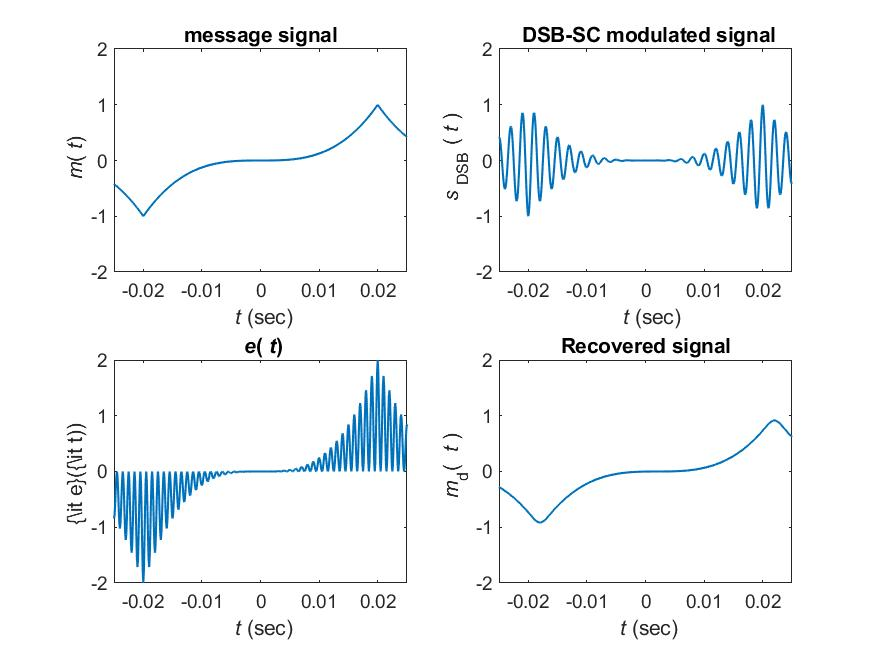
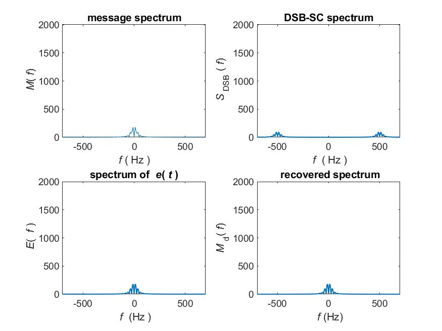
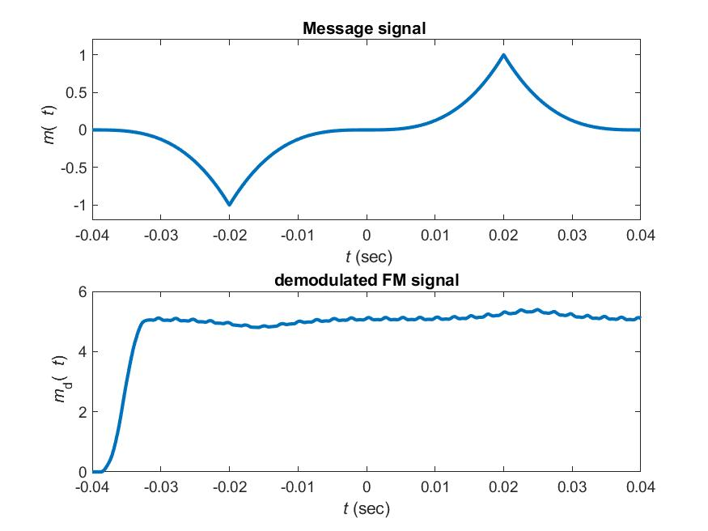
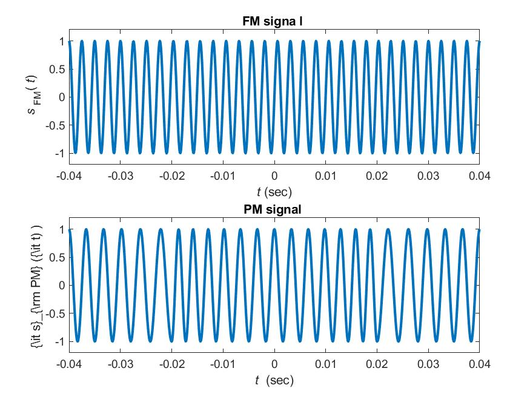
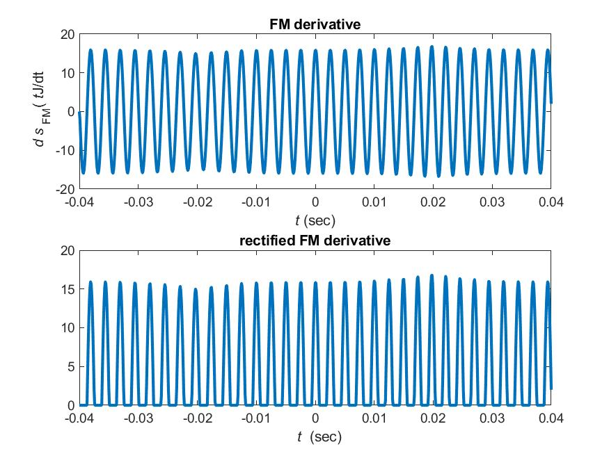
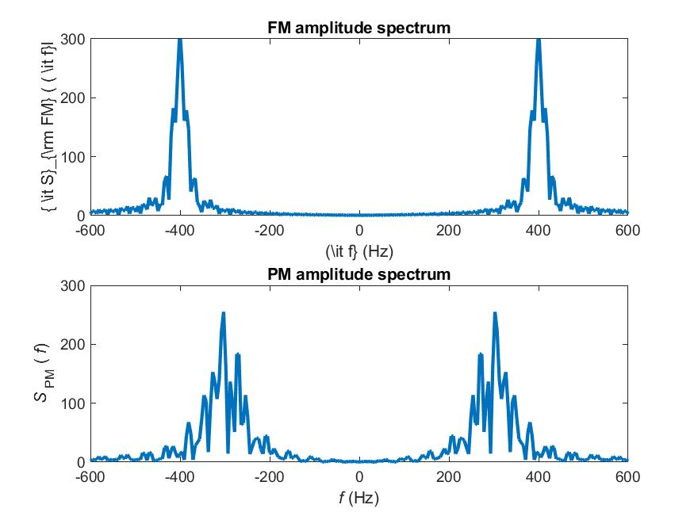

---
documentclass:
- article
geometry:
- top=1in
- left=1in
---
# Computer Assignment 3

$$ \text {Thomas Kost}$$
$$ \text {UID: 504989794}$$
This assignment will be broken up into two sections. The first section being for the computer assignments related to the book, the second being for the lab portion. Please note that for the lab portion only the non-hardware part was performed as the hardware is still shipping. Each section will present the relevant code and figures created for each problem.

## 4.13-1

This problem asked us to go through the process of AM modulation and demodulation--investigating the time and frequency components of the transmitted signal at various points of the transmission. The code used to solve this problem is heavily based on the provided examples, but adapted to fit the context of this problem. The code is as follows:

```MATLAB

%%ECE132A: Homework 2
% Author: Thomas Kost
% UID: 504989794
% Date: 4/23/20
%% 4.13-1
clear, clc;close all;
%generate signal

ts=1.e-4;
t=-0.04 : ts :0.04;
Ta=0.01; 

m_sig  = zeros(1,length(t));

for i =1:length(t)
    if(t(i) <-0.02 && t(i) >= -0.04)
        m_sig(i) = -0.125*(100*t(i)+4)^3;
    elseif (t(i)>= -0.02 && t(i) <0.02)
        m_sig(i) = 0.125*(100*t(i))^3;
    elseif (t(i)>= 0.02 && t(i) <= 0.04)
        m_sig(i) = -0.125*(100*t(i)-4)^3;
    end
end


Lfft=length(t) ; Lfft=2^ceil(log2(Lfft)) ;
M_fre=fftshift( fft (m_sig,Lfft)) ;
freqm= (-Lfft/2:Lfft/2-1) / (Lfft*ts) ;
s_dsb=m_sig.*cos(2*pi*500*t);
Lfft=length(t) ; Lfft=2^ceil(log2(Lfft)+1) ;
S_dsb=fftshift(fft(s_dsb,Lfft)) ;
freqs=( -Lfft/2: Lfft/2-1)/(Lfft*ts) ;
Trange=[-0.03 0.03 -2 2]
figure(1)
subplot(221); tdl=plot(t,m_sig);
axis(Trange); set(tdl, 'Linewidth' , 1) ;
xlabel('{\it t} (sec)') ; ylabel('{\it m}({\it t})')
subplot(223) ; td2=plot(t,s_dsb);
axis(Trange) ; set(td2, 'Linewidth' , 1) ;
xlabel('{\it t} (sec)') ; ylabel('{\it s}_{\rm DSB}({\it t}) ') 

Frange=[-600 600 0 200]
subplot(222) ; fdl=plot(freqm,abs(M_fre));
axis(Frange); set(fdl, 'Linewidth' ,1);
xlabel ('{\it f} (Hz)') ; ylabel ('{\it M} ({\it f})')
subplot (224);fd2=plot(freqs,abs(S_dsb));
axis(Frange); set(fd2, 'Linewidth',1);
xlabel ( '{\it f}(Hz)') ; ylabel ( '{\it S}_{\rm DSB} ({\it f}) ') 

B_m=250; %Bandwidt h of the signal is B_m Hz.
h=fir1(40,(B_m*ts)); 

fc=500;
% Demodulation begins by multiplying with the carrier
s_dem=s_dsb.*cos(2*pi*fc*t)*2;
S_dem=fftshift(fft(s_dem,Lfft));
% Using an ideal LPF with bandwidth 150 Hz
s_rec=filter(h,1,s_dem);
S_rec=fftshift(fft(s_rec,Lfft));
Trange=[-0.025 0.025 -2 2];
figure(2)
subplot(221) ; tdl=plot(t, m_sig) ;
axis(Trange) ; set(tdl, 'Linewidth' ,1) ;
xlabel('{\it t} (sec)') ; ylabel('{\it m}({\it t})') ;
title('message signal');
subplot(222); td2=plot(t,s_dsb);
axis(Trange) ; set(td2 , 'Linewidth',1) ;
xlabel (' {\it t} (sec)') ; ylabel ( ' {\it s}_{\rm DSB} ({\it t }) ')
title( ' DSB-SC modulated signal') ;
subplot(223);td3=plot(t,s_dem);
axis(Trange) ; set(td3, 'Linewidth',1) ;
xlabel('{\it t} (sec)') ; ylabel('{\it e}({\it t)) ')
title(' {\it e}({\it t}) ' ) ;
subplot(224);td4=plot(t, s_rec) ;
axis(Trange) ; set(td4, 'Linewidth' , 1);
xlabel ('{\it t} (sec)'); ylabel('{ \it m}_d( {\it t })')
title('Recovered signal' );
Frange=[-700 700 0 2001] ;
figure(3)
subplot(221); fd1=plot(freqm,abs(M_fre));
axis(Frange) ; set(fdl,'Linewidth',1) ;
xlabel('{\it f} ( Hz ) '); ylabel('{\it M}({\it f})') ;
title('message spectrum');
subplot(222);fd2=plot(freqs,abs(S_dsb)) ;
axis(Frange); set(fd2, 'Linewidth' ,1) ;
xlabel('{\it f } ( Hz )'); ylabel('{\it S}_{\rm DSB} ({\it f})') ;
title('DSB-SC spectrum') ;
subplot(223) ; fd3=plot(freqs,abs(S_dem)) ;
axis (Frange) ; set(fd3 ,'Linewidth' , 1);
xlabel('{\it f } (Hz )'); ylabel('{ \it E}({ \it f }) ');
title('spectrum of {\it e}({\it t })' ) ;
subplot(224) ; fd4=plot(freqs,abs(S_rec));
axis(Frange) ; set(fd4, 'Linewidth' ,1) ;
xlabel('{\it f} (Hz)') ; ylabel('{\it M} _d({\it f}) ');
title('recovered spectrum' ) ;
```

This code produced the following four figures. Figure 1 corresponds to parts A and B of the problem. This shows the time domain of the signal, the frequency domain of the signal, the time domain of the DSB-SC signal, and the corresponding frequency domain of the signal. Figure 2 shows the demodulates signal and its corresponding spectrum (part c). Figure 3 shows the recovered signal and its frequency response (part d)







## 4.13-5

This problem asked us to go through the process of frequecny and phase modulation for a given input. We were asked to look at the signal, the modulated signal, and the recovered signal in both the time and frequency domain. The code for this was agian heavily adapted from the relevant examples to fit our problem. The code for this problem is as follows:

```MATLAB
%%ECE132A: Homework 2
% Author: Thomas Kost
% UID: 504989794
% Date: 4/23/20
%% 4.13-5
clear,clc,close all;
ts=1.e-4 ;
t=- 0.04 : ts:0.04 ;
Ta=0.01;
m_sig  = zeros(1,length(t));

for i =1:length(t)
    if(t(i) <-0.02 && t(i) >= -0.04)
        m_sig(i) = -0.125*(100*t(i)+4)^3;
    elseif (t(i)>= -0.02 && t(i) <0.02)
        m_sig(i) = 0.125*(100*t(i))^3;
    elseif (t(i)>= 0.02 && t(i) <= 0.04)
        m_sig(i) = -0.125*(100*t(i)-4)^3;
    end
end
Lfft=length (t); Lfft=2^ceil(log2(Lfft));
M_fre=fftshift(fft (m_sig,Lfft));
freqm=( -Lfft/2 :Lfft/ 2- 1) /(Lfft*ts) ;
B_m=100; %Bandwidth of the signal i s B_m Hz .
% Design a simple lowpass filter with bandwidth B_rn Hz .
h=fir1(80,[B_m*ts]) ;
%
kf=50*pi;
m_intg=kf*ts*cumsum(m_sig);
s_fm=cos(2*pi * 400*t+m_intg) ;
s_pm=cos(2*pi* 300 *t+pi*m_sig) ;
Lfft=length(t) ; Lfft=2^ceil(log2(Lfft) +1) ;
S_fm=fftshift(fft(s_fm, Lfft)) ;
S_pm=fftshift(fft(s_pm,Lfft)) ;
freqs=(-Lfft/2 :Lfft/2-1)/(Lfft*ts) ;
s_fmdem=diff ( [s_fm(1) s_fm]) /ts /kf; 
s_fmrec=s_fmdem.*(s_fmdem>0);
s_dec=filter(h,1,s_fmrec) ;
% Demodulation
% Using an ideal LPF with bandwidth 200 Hz
Trange1=[-0.04 0.04 -1.2 1.2] ;
figure(1)
subplot(211);m1=plot(t,m_sig);
axis(Trange1); set(m1, 'Linewidth' ,2);
xlabel('{\it t} (sec)'); ylabel(' {\it m}({ \it t})') ;
title('Message signal ' ) ;
subplot(212);m2=plot(t,s_dec) ;
set(m2, 'Linewidth' ,2);
xlabel('{\it t} (sec) ' ) ; ylabel( '{ \it m}_d({ \it t}) ' )
title('demodulated FM signal');
figure(2)
subplot (211);tdl=plot(t,s_fm) ;
axis(Trange1); set(tdl,'Linewidth' , 2) ;
xlabel('{\it t} (sec) ' ) ; ylabel('{\it s}_{\rm FM}({\it t})');
title('FM signa l ');
subplot(212) ; td2=plot(t, s_pm) ;
axis( Trange1) ; set ( td2, 'Linewidth' , 2 ) ;
xlabel('{\it t } (sec) ' ) ; ylabel('{\it s}_{\rm PM} ({\it t) ) ' )
title( 'PM signal ' ) ;
figure(3)
subplot(211);fpl=plot(t,s_fmdem) ;
set(fpl, 'Linewidth' , 2);
xlabel('{\it t} (sec) ' ) ; ylabel('{\it d s}_{\rm FM}({\it t}J/dt')
title( 'FM derivative') ;
subplot(212) ; fp2=plot(t, s_fmrec) ;
set(fp2,'Linewidth' , 2) ;
xlabel(' { \it t } (sec) ' );
title( 'rectified FM derivative');
Frange=[-600 600 0 300] ;
figure(4)
subplot(211);fdl=plot(freqs,abs(S_fm));
axis(Frange); set(fdl, 'Linewidth' ,2);
xlabel('(\it f} (Hz)'); ylabel( '{ \it S}_{\rm FM} ( ( \it f}l');
title('FM amplitude spectrum') ;
subplot(212) ; fd2=plot(freqs, abs(S_pm));
axis(Frange); set(fd2, 'Linewidth' ,2) ;
xlabel('{\it f} (Hz) ' ); ylabel( '{\it S}_{\rm PM} ({\it f}) ' )
title('PM amplitude spectrum') ;
```

The plots generated from this code address each part of the problem. The plots are labeld Figure 4-7. For part A, the Frequency modulated signal is shown in time domain in Figure 5, its Frequency Response is shown in Figure 7.  For part B, the FM derivative and recitfied FM derivative are plotted in Figure 6. For part C, the envelope detection is plotted adjacent to the original signal in Figure 4, showing the recovered signal compared to the input signal.









## Lab section

This section of the document shows the lab portion of the assignment. Again, note only the offline assignments have been performed as I do not yet have access to the hardware. The following section details the code that was used to complete 3.2.

```MATLAB

%%ECE132A: Homework 2
% Author: Thomas Kost
% UID: 504989794
% Date: 4/23/20
%% Hw3:lab
clear,clc,close all;
d = HM('fm_band.csv');
mv = min(min(d));
fig1=figure(1);
imshow(d,[mv,0]);
 
d = loadFile('ab1355_10s.dat');
f = ffreq(d)
fig2=figure(2);
msg(d,1,1024,2000); 
fs = 2048000 % sampling frequency
dt = 1/fs % sampling time
t = [1:length(d)]'*dt; % time of each of the samples of d
dm = d.*exp(-i*2*pi*(-396000)*t); % d is the RF data loaded above, dm is is the
% demodulated data
fig3=figure(3);
msg(dm,1,1024,2000);

dmd = decimate(dm,8,'fir');
dmdd = decimate(dmd, 8, 'fir');
f1 = ffreq(dmdd)
fs = fs/64;
dt = 1/fs ;
t1 = [1:length(dmdd)]'*dt;
dmddd = dmdd.*exp(-i*2*pi*(-388000)*t1);
dmdddd = decimate(dmddd, 8, 'fir');

fig4=figure(4);
ds = msg(dmddd,1,256,512)
plot(abs(ds(:,512)));
sound(abs(dmdddd), 32000);
```

The code produced several results. These will be broken down by question that each pertains to.

### 1

For this problem we used the provided functions to read in the provided band file. This was then used to generate the following image of the spectrum--giving us an idea where highly used frequencies exist.


### 2

For this problem we generated a few figures the process. Figure 9 shows the spectrum of a desired signal--notice how it is offset. We center the signal through a complex demodulation, the result of which is shown in figure 10. We then decimate the signal to reduce the sampling rate and give us a better understanding of what the signal actually contains. In doing this we first decimated by a factor of 64 (given to us in the instructions). We then aimed to center the band on the spectrograph. This was done through demodulating at 1000 Hz intervals until the signal was centered. This was done as the ffreq function when ran on our new data set gave us peaks every 1000 Hz, so we investigate them until the singal is centered. This occured at 388000 Hz. The resulting graph is shown in Figure 11. We then aimed to further decimate the signal until the sound quality improved. I found that decimating by another factor of 8 gave the best results. Decimating by a factor less than 8 resulted in the static being the main sound component. Decimating by a factor more than 8, gave us an extremely short sound that was mostly corrupted by the static. At 8 however, we can hear a shifting tone through the static, giving this ratio the best overall sound quality. This gave us a final decimation ratio of 512.

I have also included a plot of the final signal, shown in Figure 12.


