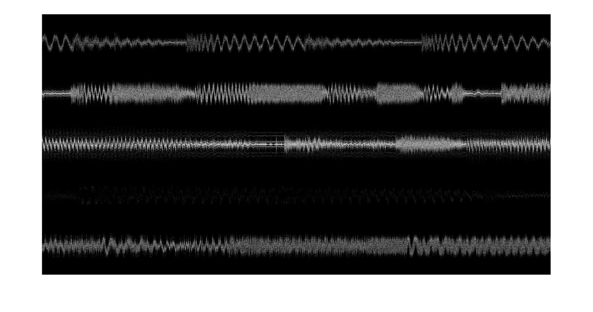
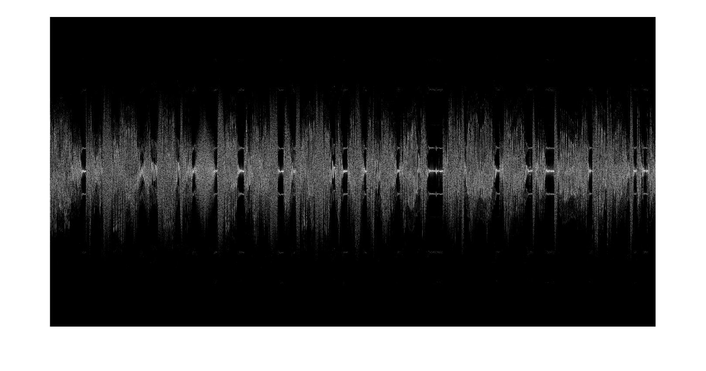

---
documentclass:
- article
geometry:
- top=1in
- left=1in
---
# Computer Assignemnt 4

This assignemnt will first show the code that was used, and then will expalin the methods and results used.

## Code
```MATLAB
%% ECE132A: Computer Assignment 4
% Author: Thomas Kost
% UID: 504989794
% Date: 5/3/2020
%%%%%%%%%%%%%%%%%%%%%%%%%%%%%%%%%%%%%%%%%%%%%%%%%%%%%%%%%%%%%%%%%%%%%%%%%%%
clear,clc,close all;


%%Relevant Code, Change subband by looking at values output from ffreq
%%this will give you various stations for each channel +/- 400000 and 
%%+/-800000 work to get from channel to channel and 0
subband = 000000;
data = loadFile('wfm941_10s.dat');
fig1 =figure(1);
ffreq( data)
fs = 2048000; % sampling frequency
dt = 1/fs; % sampling time
t = [1:length(data)]'*dt; % time of each of the samples of d
data = data.*exp(-i*2*pi*(-subband)*t);
msg(data,1,1024,2000);
saveas(fig1, 'fig1.jpg');
d = decimate(data,8,'fir'); 
fig2 = figure(2);
msg(d,1,1024,2000);
%dfm = angle(conj(d(1:end-1)).*d(2:end));
dl = d./abs(d); % Eliminate amplitude variations
load('hd.mat');
df = imag(conv(dl,hd,'same').*conj(dl));
dfd = decimate(decimate(df,8,'fir'),2,'fir');
dfd = dfd / max(abs(dfd));
fprintf('Playing Sound\n');
sound(dfd,16000);
%pause(10);
saveas(fig2,'fig2.jpg');

%This portuion of the code is commented our but was used to examine the
%subbands from the stereo
%listening to L-R
%{
fs = 2048000; % sampling frequency
dt = 1/fs; % sampling time
t = [1:length(data)]'*dt; % time of each of the samples of d
dm = data.*exp(-i*2*pi*(-67000)*t);
dfm = angle(conj(dm(1:end-1)).*dm(2:end));
dmd = decimate(dfm,8,'fir');
dmdd = decimate(dmd, 8,'fir');
dmddd = decimate(dmdd, 4, 'fir');
fprintf('Playing Second Sound');
sound(abs(dmddd),8000);
pause(10);
fs = 2048000; % sampling frequency
dt = 1/fs; % sampling time
t = [1:length(data)]'*dt; % time of each of the samples of d
dm = data.*exp(-i*2*pi*(-92000)*t);
dfm = angle(conj(dm(1:end-1)).*dm(2:end));
dmd = decimate(dfm,8,'fir');
dmdd = decimate(dmd, 8,'fir');
dmddd = decimate(dmdd, 4, 'fir');
fprintf('Playing Third Sound');
sound(abs(dmddd),8000);
%}
```
## Results

We were able to demodulate each of the different bands that appeared on the spectrogram. We can tune into each of these channels, to listen to different audio or data that is encoded in the spectrum that was measured in each file. This was done through using the method of demodulating discussed in this lab. Though using the differentiating filter, and decimating the signal, we are able to demodulate the mono component of each of these stereo channels. We can also note, that while not all spectrographs were included in this file, each of the voice encoded channels displayed the same stereo encoding. 

While the method of demodulating and decimating allowed us to hear a signal, we also needed to find a method to determine where the nearby bands existed in relation to the center frequency. So to do this we use the ffreq() function. This function allows us to see where significant signals exist in relation to the center of our data. We can see from running the code, that this returns many values. However, if we look closely, we can see that these values are clustered in several different regions. We can use these regions to come up with an approximate frequency offset of the other channel from our current channel. We can modulate our signal with a complex exponential at that freqency to recenter our data. Doing so for the various values allows us to hear what each of the channels contained!

The results of this are shown in the following table:

wfm941_10s.dat:

| Offset          | Topic                                 |
|-----------------|--------------------------------------|
| 0              |politics of Oklahoma                |
|-400000         |spanish music                       |
|-800000         |spanish music with accordion           |
|400000          |safeway add                            |
|800000          |black eyed peas song (im pretty sure)  |


wfm1053_10s.dat:

| Offset          | Topic                                 |
|-----------------|--------------------------------------|
|0 |Electric Feel (in spanish) |
|-450000|Classical Music |
|-850000|Either Katy perry or Pink! song i don't know which artist is which |
|450000|English song, I don't know it but one line is "i don't need you but i want you"|
|800000|dudes in paris, JayZ and Kanye song |


The following figures show the spectrogram of the entire recoreded spectrum (Figure 1) and of the centerband (Figure 2). We can see the sidebands more clearly in figure 2, which is a result of stereo transmission.



