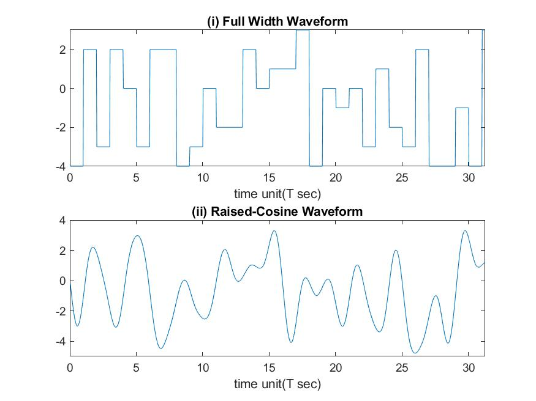
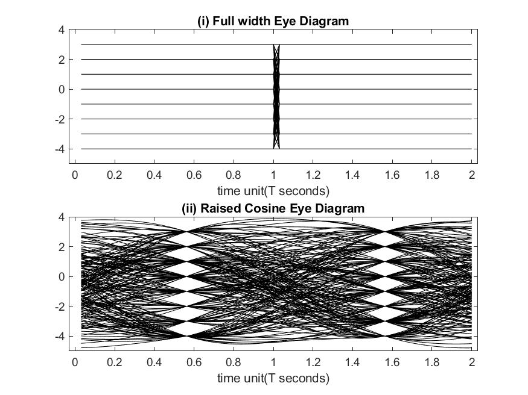

# ECE132A: Computer Assignment 5

Note that this assignment is broken up into two distict parts. The first part contains the code and results for the eye diagram exercise in Lathi. The second part is the hardware lab. Note that the prerecorded data files are being used in this part.

## Eye Diagram Problem

### Code

The following code was used to generate the results for this problem. Note that this code was adapted from the provided code in the book, so many similarities remain.

```MATLAB 
%% ECE132A: Computer Assignment 5
% Author: Thomas Kost
% UID: 504989794
% Date: 5/15/20
%%%%%%%%%%%%%%%%%%%%%%%%%%%%%%%%%%%%%%%%%%%%%%%%%%%%%%%%%%%%%%%%%%%%%%%%%%%
clear, clc, close all;

%% 6.10-4:

% generate baseband waveforms
data = ceil(8*abs(rand(1,400)))-5;
Tau = 32;                                     %define Symbol Period
Tped = 0.001;                                 %true symbol period Tped in second
dataup = upsample(data,Tau);

yfw = conv(dataup,prect(Tau));
yfw = yfw(1:end-Tau+1);

Td =4;                                        %truncate raised cosine to 4 periods
rolloff = 0.6
yrcos = conv(dataup, prcos(rolloff,Td,Tau));
yrcos = yrcos(Td*Tau-Tau/2:end-2*Td*Tau+1);
txis = (1:1000)/Tau;
Baseband = figure(1);
subplot(211);
w1 = plot(txis, yfw(1:1000)); title('(i) Full Width Waveform');
axis([0,1000/Tau -4,3]); xlabel( 'time unit(T sec)');
subplot(212);
w2=plot(txis,yrcos(1:1000));title('(ii) Raised-Cosine Waveform');
axis([0,1000/Tau -5,4]); xlabel( 'time unit(T sec)');

Nwidth =2;
edged=1/Tau;
eyeplots = figure(2);
subplot(211);
eye1 = eyeplot(yfw,Nwidth,Tau,0); title('(i) Full width Eye Diagram');
axis([-edged Nwidth+edged,-5,4]);xlabel('time unit(T seconds)');
subplot(212);
eye2 = eyeplot(yrcos,Nwidth,Tau,0); title('(ii) Raised Cosine Eye Diagram');
axis([-edged Nwidth+edged,-5,4]);xlabel('time unit(T seconds)');

saveas(Baseband, 'baseband.jpg');
saveas(eyeplots, 'eyeplots.jpg');

%% Fucntions

% generate full width rectangular pulse  of width T
% usage pout = pnrz(T)
function pout = prect(T)
pout = ones(1,T);
end

% generate rolloff cosine, 
% usage y=prcos(rollfac,length,T)
function y=prcos(rollfac,length,T)
% 0 <= rollfac <= 1
% length is the one-sided pulse length in the number of T
% length  = 2T+1
% T is oversampling rate
y=rcosdesign(rollfac,length, T,'normal');
y = y/max(y);
end

function eyesuccess = eyeplot(onedsignal,Npeye, NsampT,Toffset)
Noff = floor(Toffset*NsampT);
Leye = ((1:Npeye*NsampT)/NsampT);
Lperiod=floor((length(onedsignal)-Noff)/(Npeye*NsampT));
Lrange = Noff+1:Noff+Lperiod*Npeye*NsampT;
mdsignal=reshape(onedsignal(Lrange),[Npeye*NsampT Lperiod]);
plot(Leye,mdsignal,'k');
eyesuccess=1;
return
end
```

### Results

The following two figures show the baseband signals (Figure 1) and the corresponding eye diagrams(Figure 2). This is shown for full-width rectangualr signals and raised cosine signals.





## Hardware Lab

### Code

The following code was used to perform the tasks requested in the hardware lab. We can note that the code makes use of the previous functions and techniques used in previous assignments to help display and decode the recorded signals.

```MATLAB
%% ECE132A: Computer Assignment 5 (Hardware Lab)
% Author: Thomas Kost
% UID: 504989794
% Date: 5/18/20
%%%%%%%%%%%%%%%%%%%%%%%%%%%%%%%%%%%%%%%%%%%%%%%%%%%%%%%%%%%%%%%%%%%%%%%%%%%
clear, clc, close all;

dk = loadFile('rke312590.dat');
fs = 2048000;
t = [1:length(dk)]/2048000;
figure(1);
plot(t(1:1000:end),abs(dk(1:1000:end)));
figure(2);
plot(t(2*fs:2.1*fs),abs(dk(2*fs:2.1*fs)));
figure(3)
plot(t(2.03*fs:2.04*fs),abs(dk(2.03*fs:2.04*fs)));
dkd = abs(dk)>15;
figure(4);
subplot(211);
plot(t(2.03*fs:2.06*fs),abs(dkd(2.03*fs:2.06*fs)));
axis([2.03,2.06, -0.5, 1.5]);
title('Key Press 1');
subplot(212);
plot(t(5.185*fs:5.215*fs),abs(dkd(5.185*fs:5.215*fs)));
axis([5.185,5.215, -0.5, 1.5]);
title('Key Press 2');
%signal span
%2.03-2.568
%5.185-5.717
key1 = dkd(2.03*fs:2.568*fs);
key2 = dkd(5.185*fs:5.717*fs);
starting_condition = 0;

%key1
width = 3832-2478; %found from data
%first midpoint
mid = (3832+2478)/2;
key1_bits = key1(mid:width:end);
%key2
width = 5963-4614;
mid = (5963+4614)/2;
key2_bits = key2(mid:width:end);

di = loadFile('ism910.dat');
figure(5);
msg(di,1,512,2048);
figure(6);
plot(abs(di(1:1000:end/8)));
figure(7);
msg(di, 1873000,128,512,20);

dat = loadFile('vhf145.dat');
figure(8);
msg(dat, 1, 512,128,30);
ffreq(dat)
fs = 2048000; % sampling frequency
dt = 1/fs; % sampling time
t = [1:length(dat)]'*dt;
dat = dat.*exp(-i*2*pi*(-10000)*t);
d = decimate(dat,8,'fir');
d=decimate(d,8,'fir');
msg(d,1,200,128,30);

load('hd.mat');
df = imag(conv(d,hd,'same').*conj(d));
msg(df,1,128,512,30);
figure(9);
plot(df);
ddf = df(1:8e4);
plot(ddf);
ddf = (ddf>-20) + (ddf<-130);
figure(10);
%apply exponential smoother and then demarcate
% alpha = 0.8;
% for i = 3:length(ddf)
% ddf(i) = alpha*ddf(i) +(1-alpha)*ddf(i-1);
% end
% for i = 3:length(ddf)
% ddf(i) = alpha*ddf(i) +(1-alpha)*ddf(i-1);
% end
% for i = 3:length(ddf)
% ddf(i) = alpha*ddf(i) +(1-alpha)*ddf(i-1);
% end
window = ones(1,200);
window = [window, zeros(1,length(ddf)-200)];
for i=0:(length(ddf)/200)-1
    win =circshift(window,200*i);
    sum1 = sum(ddf'.*win);
    ddf(200*i+1: 200*(i+1))= sum1;
    
end
%threshhold about 20
ddf = ddf>20;
plot(ddf)
%examine the bit lengths
len =2000;
mid = 2000;
dfm_bits = ddf(mid:len:end);
fid = fopen('bits.txt','w');
fprintf(fid, 'Key 1 bits:\n');
fprintf(fid,'%i', key1_bits);
fprintf(fid,'\n');
fprintf(fid, 'Key 2 bits:\n');
fprintf(fid,'%i', key2_bits);
fprintf(fid, '\n');
fprintf(fid, 'DFM bits:\n');
fprintf(fid,'%i', dfm_bits);
fprintf(fid, '\n');
fclose(fid);

```

### Results

The following text shows the decoded bits for the first key click, the second key click, and the digital FM signal. I will now describe the process of extracting the bit streams from the data provided. For the car key signals, using a simple threshhold of 15 was able to give us a binary representation of the data for the samples. I then found the length of a single pulse width and found the midpoint of the first data point for each key fob signal. I then sampled the signal at integer numbers of the pulse width to find the center of each bit. This gave the bit streams below. However, it was much more difficult to find the bitstream from the digital radio. This was because after demodulating, the data was still oscillating so a simple threshhold cannot be used. As a reusult, I used a windowing technique to find an average value within a space of 200 samples of the absolute value of the signal. This allowed me to use a threshhold technique to differentiate between where a bit starts and ends. This allowed me to then use the same process as I did for the key fob signal to extract the bits. The results are shown in text below.

Key 1 bits:
10101010100101010110010101000010110010101010100101011010101010100010110101010011010010010110100101100011010011001 01100111010100110011010000011001100110100100110101010100110100101001010101100100110101010100101010010110100110101 01000110101001011001001101010010110100100110010101010101010010110010101010100110010101010101010011010101010100101 11010101001101010010011010010110011010001100101100110100100110011010010110001100110100101101001010100110101010001 01010110010110100101010010101010110010011010101001100101001011001011010010010110100101100010101010101010101110010 10101010110010010101010101011010010101010010110100101001101010010110010010110011010011000101100110101001110011010 01011001100011010010110101010010011010101001010010110010110101010010010101010110100011010101001101010001011001011 010100100110100101100

Key 2 bits:
10101010100101010110101010010101001101010010010101011010101001010010110101010100010101101001011001001100101100110 00110100110100110010101001010110010010110010110101001010011010101001001010110010110100101010010101010111010011010 10100100101100110101010001101001010101101001001010101010100101011010101010100100110101001010100101101010101010001 01101010101001001011010010110100011001011001100110010011010011010100100101011001010011001011010101010001101010100 10101001100101101010100100101010101101000110101010010101100011010101001101000101010110101000101010101010101001101 01010101010011101010010101010111010101010100101110101010100101011101001011010011000101100110011010001101001101010 10001010110010101100010110101010100110010101001010101100010110101010100100101010110100110010101001010110011101010 1001101001001


DFM bits:
1010101010001110011101011101000101110110

We also have the spectrogram associated with the FM 915MHz band. This is shown in the below image.


