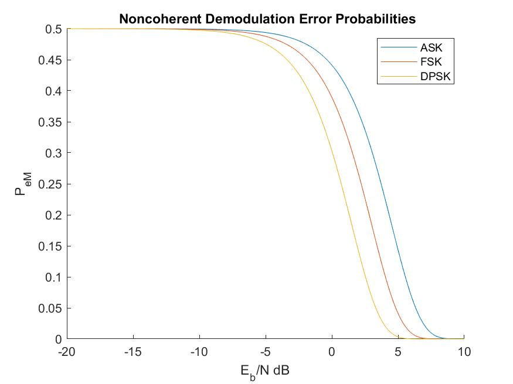
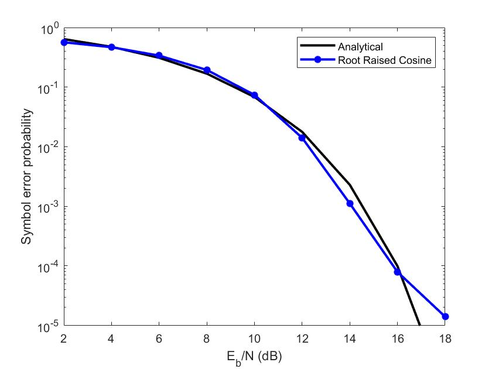

--- 
documentclass:
- article
geometry:
- top=1in
- left=1in
---

# ECE132A Computer Assignment 6

This documnent will be broken into two sections--one for the code and one for the results produced. We can see that the code is annotated to depict which portion of the code is responsible for each question.

## Code

```MATLAB
%% ECE132A: Computer Assignment 6
%  Author : Thomas Kost
%  UID: 504989794
%  Date: 5/25/20
%%%%%%%%%%%%%%%%%%%%%%%%%%%%%%%%%%%%%%%%%%%%%%%%%%%%%%%%%%%%%%%%%%%%%%%%%%%

clear,clc,close all;

%% Lathi 9.11-1:
%noncoherent demodulation probability of error
E_b_N = logspace(-2,1,1000);
ASK = 0.5*exp(-0.125*E_b_N.^2);
FSK = 0.5*exp(-0.25*E_b_N.^2);
DPSK = 0.5*exp(-0.5*E_b_N.^2);

%  plot
fig1 = figure(1);
hold on;
loglog(10*log10(E_b_N), ASK);
loglog(10*log10(E_b_N), FSK);
loglog(10*log10(E_b_N), DPSK);
hold off;
legend('ASK', 'FSK', 'DPSK');
xlabel('E_b/N dB');ylabel('P_{eM}');
title(" Noncoherent Demodulation Error Probabilities");
saveas(fig1, 'noncoherent_plot.jpg');

%% Lathi 9-12-2a:
%  SER plot
L = 1000000;
f_ovsamp = 8;
delay_rc =4;
%  generate raised cosine
prcos = rcosflt([1],1,f_ovsamp, 'sqrt', 0.5, delay_rc);
prcos = prcos(1:end-f_ovsamp+1);
prcos=prcos/norm(prcos);
prcos = prcos/max(prcos);
pcmatch = prcos(end:-1:1);

%  generate random signal data
s_data = (-2*round(rand(L,1) )+1+...
    +j*(-2*round(rand(L,1))+1)).*(rand(L,1)>0.2);
%  upsample
s_up = upsample(s_data,f_ovsamp);
delayrc = 2*delay_rc*f_ovsamp;
xrcos = conv(s_up,prcos);

%  find signal length
Lrcos = length(xrcos);
SER= [];
noiseq=randn(Lrcos,1)+j*randn(Lrcos,1);
Es =30; %symbol energy
%generate channel noise
for i=1:9
    Eb2N(i) = i*2; %#ok<SAGROW>
    Eb2N_num = 10^(Eb2N(i)/10);
    Var_n = Es/(2*Eb2N_num);
    signois = sqrt(Var_n/2);
    awgnois = signois*noiseq; %AWGN
    %add note to signals at the channel output
    yrcos=xrcos+awgnois;
    %apply matched filter
    z1 = conv(yrcos,pcmatch); clear awgnois  yrcos;
    %sample recieved signal
    z1 = z1(delayrc+1:f_ovsamp:end);
    z1 = z1/abs(max(real(z1)));
    
    %decide based on sampple
    dec1 = (1+j)*((real(z1(1:L))+imag(z1(1:L)))>0.5).*((real(z1(1:L))>0).*(imag(z1(1:L))>0))+ ...
        (1-j)*((-real(z1(1:L))+imag(z1(1:L)))<-0.5).*((real(z1(1:L))>0).*(imag(z1(1:L))<0)) + ...
        (-1-j)*((real(z1(1:L))+imag(z1(1:L)))<-0.5).*((real(z1(1:L))<0).*(imag(z1(1:L))<0)) + ...
        (-1+j)*((-real(z1(1:L))+imag(z1(1:L)))>0.5).*((real(z1(1:L))<0).*(imag(z1(1:L))>0));
    SER = [SER; sum(s_data~=dec1)/L]; %#ok<AGROW>
    Q(i) = 3*0.5*erfc(sqrt((2*Eb2N_num/5)/2));
end
fig2 = figure(2);
subplot(111);
figber = semilogy(Eb2N,Q,'k-',Eb2N,SER,'b-*');
axis([2 18 0.99e-5 1]);
legend('Analytical', 'Root Raised Cosine');
xlabel('E_b/N (dB)'); ylabel('Symbol error probability');
set(figber,'Linewidth',2);
%saveas(fig2,'qam_ser.jpg');
fig3 = figure(3);
subplot(111);
plot(real(z1(1:min(L,4000))), imag(z1(1:min(L,4000))),'.');
axis('square');
xlabel('Real part of matched filter output samples');
ylabel('Imagninary part of matched filter output samples');
saveas(fig3,'constillation.jpg');
```

## 9.11-1

In this result we can see that the perfomance of the three communication schemes for a given SNR will have a bit error rate with DPSK being the lowest, followed by FSK, and ASK. This is in line with what we would expect to see based on the performance of these schemes in analog modulation. This produced Figure 1, showing the relative error rates.



## 9.12-2

Here we analytically calculated the error rate of 5-ary QAM. We also simulated the communcation and sampling of the scheme, and plotted the compared bit rate (this scheme was using shaped pulses). We then plotted the constillation diagram for reference. The symbol error rate plot is shown in Figure 2. The consitllation diagram is shown in Figure 3. This diagram will give us insignt to how the noise is distorting the signal and affecting classification.



