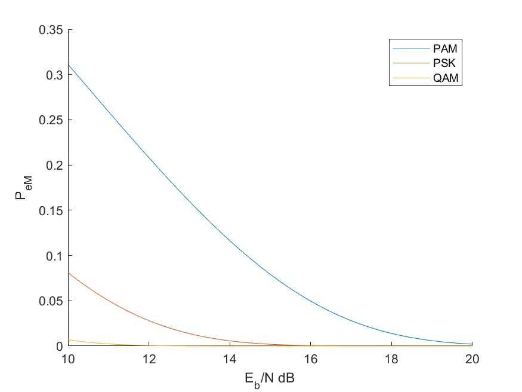

---
documentclass:
- article
geometry:
- top=1in
- left=1in
---

# ECE132A Homework 7 9.6-9:
The following is the matlab code that was used to generate the plot comparing 16-ary noncoherent modulation schemes.

```MATLAB
%% ECE132A: Hw 7 
%  Author: Thomas KOst
%  Date: 5/25/20
%%%%%%%%%%%%%%%%%%%%%%%%%%%%%%%%%%%%%%%%%%%%%%%%%%%%%%%%%%%%%%%%%%%%%%%%%%%
clear, clc, close all;
%% 9.6-9:

%  P_e v.s. E_b/N
E_b_N = logspace(1,2,1000);
M = 16;
PAM = (2*(M-1)/M)*qfunc(sqrt(6*log2(M)*E_b_N/(M^2-1)));
PSK= 2*qfunc(sin(pi/M)*sqrt(E_b_N*2*log2(M)));
QAM=3*qfunc(sqrt(0.8*E_b_N));

% plot
fig1 = figure(1);
hold on;
loglog(10*log10(E_b_N), PAM);
loglog(10*log10(E_b_N), PSK);
loglog(10*log10(E_b_N), QAM);
hold off;
legend('PAM', 'PSK', 'QAM');
xlabel('E_b/N dB');ylabel('P_{eM}');
saveas(fig1, 'plot.jpg');
```

This code generated Figure 1, which is the plot of the performance of the shown noncoherent demodulation schemes.


