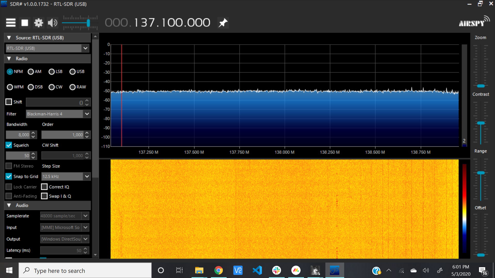
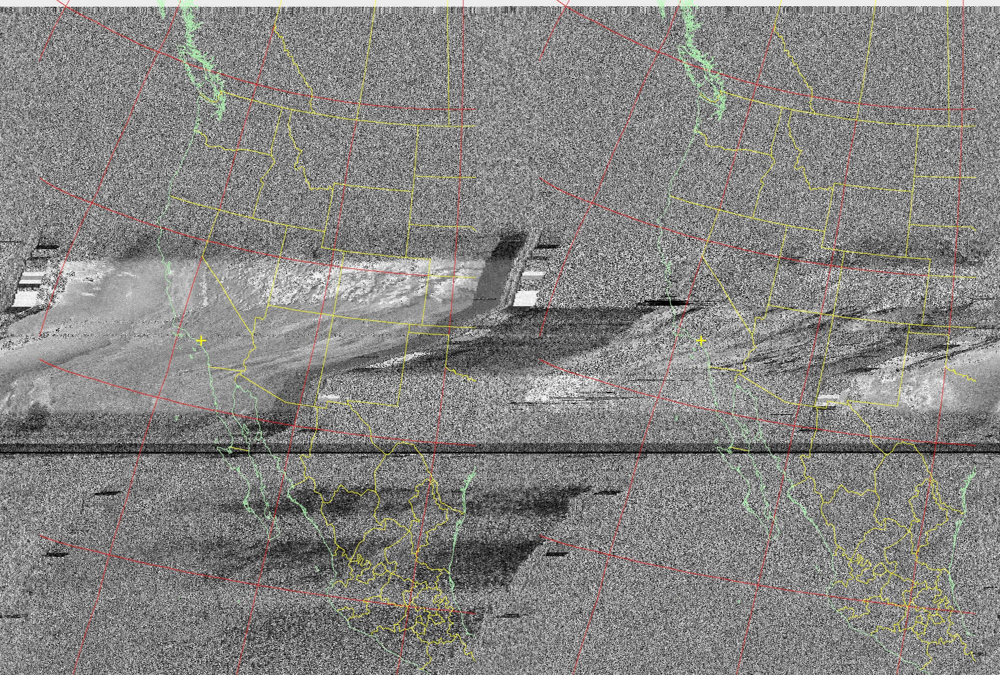

---
documentclass:
- article
geometry:
- top=1in
- left=1in
---

# Midterm Project: NOAA 19 Reception

$$ \text{Thomas Kost UID: 504989794}$$

## Procedure

The procedure will be a short summary of the document we were provided, as the guide was quite thourogh in getting the project set up and executed. 
First, the software installation had to be done. As I just recently recieved the module, I first went through the hardware labs to get everything set up and ensure I knew how to record raw data files using the command line tools. Once I was comfortable with this, I installed the virtual audio cable and WXtoIMG software and configured those two softwares and SDRSharp to work together. Once this was done, I checked the passover schedule and found a suitable time to record. I configured my antenna as specified (120 degrees apart and 53cm long) and placed it wrapped around the railing of a balcony. Once it was time to record the passover, I started recording on SDRSharp and used the autorecord feature of the WXtoIMG software to begin processing the incoming data. Afterwards, all files were saved.

## Difficulties

One difficulty that arose was in the actual reception itself. While I was able to get a fairly clear image, I was limited in the time I had a strong signal from the satelite due to the placement of my apartment building and the surrounding buildings. Unfortunately, this cut my reception time down on both sides of the passover. However, what is quite interesting is that as a result, we can see very clearly the band that I was able to strongly recieve during. This shows the point at which I should have been able to recieve signal, to the point at which I was recieving a signal at an adequate enough SNR to make sense of the data. Additionally, while the surrounding buildings could be the cause of the blur, I was able to recieve a fairly clear picture in the middle of the passover. This could be due to the fact that I was recording off of my balcony, and so had a decent height from which to recieve from.

## Results

In doing this project, I got much more comfortable with using the RTL-SDR module. I was able to setup the necessary software suite, and interface SDRSharp with the WXtoIMG software. Doing so allowed me to record data transmitted from NOAA19 and view the image being sent in real time. Because the numerous features of this software, I was able to not only watch the image being decoded live, but also able to see that the spectrum changed distinctly during that passover. Beforehand, there was absolutely no signal, but once the passover began a small rise began at 137mHz. Additonally, I was able to see the signal drop significantly a little bit over the halfway point of the passover (about the time my building would have began to block the signal). I was able to see the signal come and go, with the predicted time of the satelitte passover. The following Images show the final Image produced and images of the spectrum before and during the passover.

The following three figures detail the results. The first image shows the spectrum when the satellite began its passover. We can see a sharp peak exactly at the expected frequency. This can be justaposed with the second image, depicting the spectrum after the passover event--showing that the signal only existed while the satellite was overhead.

Figuere 1 shows the image pulled from the WXtoIMG software. As described, we can see a clear band of reception directly over the greater los angeles area. 

## Planned Direction of Continued Investigation

While, I have not currently implemented any of this (I plan on playing around with it and uploading an update if anything significant is done) I am interested in looking at the encoding of the signal. I am interested to see if I can, using the tools we have learned in this class, first demodulate the FM to recover the digital signal being transmitted, and then find a binary equivalent of the data stream. From there, I would be interested into researching how the data is encrypted to see if it is feisable to try to decrypt the data and recover an image (even if less clear).
