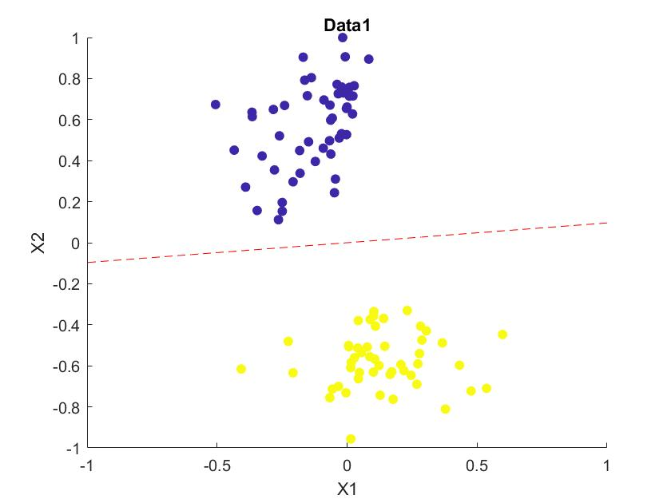
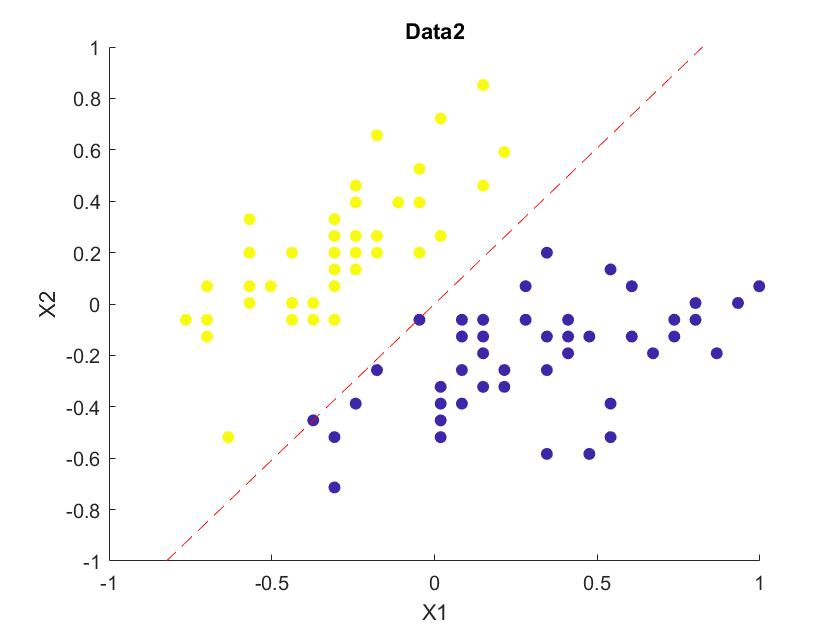
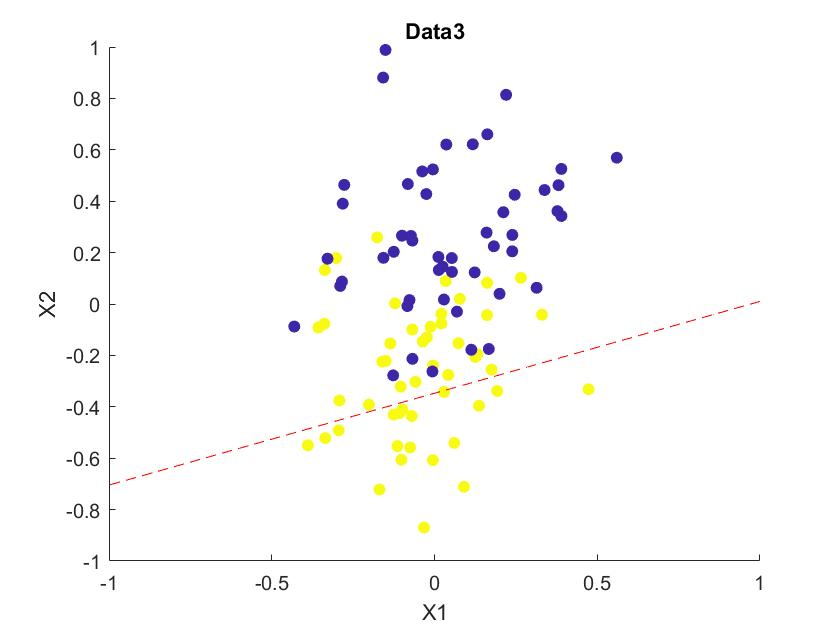

---
documentclass:
- article
geometry:
- top=1in
- left=1in
---

# MATLAB Portion of Homework 1

This section outlines the work done for problem 6 of the Homework 1. This probelem is focused on implementing the perceptron algorithm.

## MATLAB Code

The following code is the code implementing the perceptron algorithm for problem 6. Note that the code is commented to designate which parts are relevant to each section of the problem.

```MATLAB
%ECEM146 Homework 1
%Author: Thomas Kost
%date: 4/1/2020

%%%%%%%%%%%%%%%%%%%%%%%%%%%%%%%%%%
% Problem 6                      %
%%%%%%%%%%%%%%%%%%%%%%%%%%%%%%%%%%

clear, clc;
d1 = dlmread('data1.csv');
d2 = dlmread('data2.csv');
d3 = dlmread('data3.csv');

%Part A%
figure(1);
scatter(d1(:,1),d1(:,2), [], d1(:,3), 'filled');
figure(2);
scatter(d2(:,1),d2(:,2), [], d2(:,3), 'filled');
figure(3);
scatter(d3(:,1),d3(:,2), [], d3(:,3), 'filled');

%Part B%
%note: perceptron algorithm is defined at the bottom
max_iter = 1000;
[w1,iterations_1, u1]=run_perceptron(d1,max_iter);
[w2,iterations_2, u2]=run_perceptron(d2,max_iter);
[w3,iterations_3, u3]=run_perceptron(d3,max_iter);

f1 = @(x1,x2) w1(1) +w1(2)*x1 + w1(3)*x2;
f2 = @(x1,x2) w2(1) +w2(2)*x1 + w2(3)*x2;
f3 = @(x1,x2) w3(1) +w3(2)*x1 + w3(3)*x2;
figure(1);
hold on;
fcontour(f1,[-1,1,-1,1],'--r', 'LevelList', 0);
hold off;
figure(2);
hold on;
fcontour(f2,[-1,1,-1,1],'--r', 'LevelList', 0);
hold off;
figure(3);
hold on;
fcontour(f3,[-1,1,-1,1],'--r', 'LevelList', 0);
hold off;
%print results
fprintf('Data1 produced w = {%f,%f} and b = %f\n',w1(2),w1(3), w1(1));
fprintf('Data2 produced w = {%f,%f} and b = %f\n',w2(2),w2(3), w2(1));
fprintf('Data3 produced w = {%f,%f} and b = %f\n',w3(2),w3(3), w3(1));
fprintf('Data1 took %i updates until the algorithm terminated\n', u1);
fprintf('Data2 took %i updates until the algorithm terminated\n', u2);
fprintf('Data3 took %i updates until the algorithm terminated (due to max_itter being reached)\n', u3);

%Part C%
d1_min = min_dist(w1,d1);
d2_min = min_dist(w2,d2);
fprintf ('The minimum distance for Data1 is %f\n',d1_min);
fprintf ('The minimum distance for Data2 is %f\n',d2_min);
fprintf ('The upper bound on updates for Data1 is %f\n',(1/d1_min)^2);
fprintf ('The upper bound on updates for Data2 is %f\n',(1/d2_min)^2);


%Perceptron Algorithm%
function [w_final,max_iter_done, updates] = run_perceptron(data, max_iter)
    w = zeros(3,1);%w0,w1,w2
    max_iter_done_init = 0;
    updates=0;
    y = data(:,3);
    for i=1:max_iter
        done = 1;
        for j=1:length(data)
            %check if the our activation is good for all values
            x_j = [1;data(j,1); data(j,2)];
            a = w'*x_j;
            if(y(j)*a <= 0)
                done = 0;
                w = w + y(j)*x_j;
                updates= updates+ 1;
            end
        end
        if done==0
             max_iter_done_init = max_iter_done_init + 1;
        end
    end
    w_final = w;
    max_iter_done = max_iter_done_init;
end

%getting min distance
function min = min_dist(w_gen, data)
%first evalueat w_gen at two points, x1=0,1
w_1 = [0;0;-(w_gen(1)/w_gen(3) + w_gen(2)/w_gen(3)*0)];
w_2 = [0;1;-(w_gen(1)/w_gen(3) + w_gen(2)/w_gen(3)*1)];
v1 = w_1-w_2;
dist_min = inf;
for i = 1:length(data)
    v2 = [0;data(i,1);data(i,2)]-w_2;
    d = norm(cross(v1,v2))/norm(v1); %parallelogram and divide base
    if (d <dist_min)
        dist_min=d;
    end
end
min= dist_min;
end
```

## MATLAB Results and Answers

All generated plots are shown here. The plots are labeled with the part with which they correspond. Note that the answers to each question are also listed here. This portion of th file is broken up by part so the relevant answers and graphs will be under each listed part.

### 6a:

We plotted the three data sets the results are shown below in figures 1,2, and 3.
We can see from the plots that data sets 1 and 2 are both linearly seperable. This is beacuse these two sets form two clear clusters that do not overlap with one another. This means that these groupings can be divided by a simple linear boundry. As a result they are linearly seperable. We can compare this to data set 3, where the two clusters clearly overlap one another. In this case the groups cannot be simply determined by a linear boundary/inequality.







### 6b:

Figures 1, 2, and 3 show the decision boundary plotted along the data sets. Note that these figures show both the results from part a and part b. This allows us to see that for the linearly seperable data sets we are able to successfully classify the data using the perceptron algorithm.
In performing the algorithm on the three data sets we found tthe following results:
$$\text{Data1 produced w = {0.142172,-1.473230} and b = 0.000000}$$
$$\text{Data2 produced w = {-1.109180,0.913440} and b = 0.000000}$$
$$\text{Data3 produced w = {1.029140,-2.879662} and b = -1.000000}$$
$$\text{Data1 took 2 updates until the algorithm terminate}$$
$$\text{Data2 took 4 updates until the algorithm terminated}$$
$$\text{Data3 took 4501 updates until the algorithm terminated(due to max-itter being reached)}$$
We can see here the vectors generated for each attempt at performing the perceptron algorithm. Additionally, we can see the number of updates that each vector required.This can give us an understanding of the convergence of the perceptron algorithm for each data set. We can see for the first data set (Data1.csv) the algorithm required only 2 updates to successfully calssify each data point. This was done in a single iteration. This suggests that the data is more easily linearly seperable as the algoithm converged to a single acceptable result quite quickly. We can see a similar result for the second data set (Data2.csv). This data set only took 4 updates to converge. This also suggest that the data is more easily linearly seperable--the rate of convergence was still quite quick. We can note a different result for the thrid data set--as we would expect. We can see here that the data set took 4501 updates before the algorithm terminated. Here, we can see that the third data set took 1000 iterations, meaning that the perceptron algorithm was oscillating and not converging to a final value. Here we can see that the perceptron algorithm does not converge. This is to be expected as we can visually see that the data is not linearly seperable. So there does not exist a boundary that our activation criteria will not trigger for each data point.

### 6c: 

We can find the minimum distance from our decision boundary to any of the data points in our linearly seperable data sets. Here we do this for the first and second data set. We can find this through finding points on our decision boundary and generating a vector along our boundary, and a vector to each data point. The norm of the corss product of each of these two vectors will be the area of a parrolelogram enclosing the vectors. This can be divided by the norm of the vector along our boundary to find the perpendicualr distance from our point to the boundary. This can be done for each point and we can record the minimum value. The reciprocal of the square of this value will give us our upper bound on updates for each data set. We found the following results:
$$\text{The minimum distance for Data1 is 0.136868}$$
$$\text{The minimum distance for Data2 is 0.000265}$$
$$\text{The upper bound on updates for Data1 is 53.381998}$$
$$\text{The upper bound on updates for Data2 is 14251382.479570}$$
We can clearly see that this upper bound is far above the number of updates we found necessary for the algorithm to converge. This makes sense as this value is an upper bound to our upper bound on the number of updates required to converge. We can also notice that these numbers do make sense given the data. Visually, we can see that the linear boundary in Data1 has a decent margin. This margin suggests that many fewer updates are needed to converge. Additionally, we can see in Figure 2 that some data is nearly on the decision boundary. This means that there is a much smaller margin, and as a result a much larger upper bound on the number of updates required.
