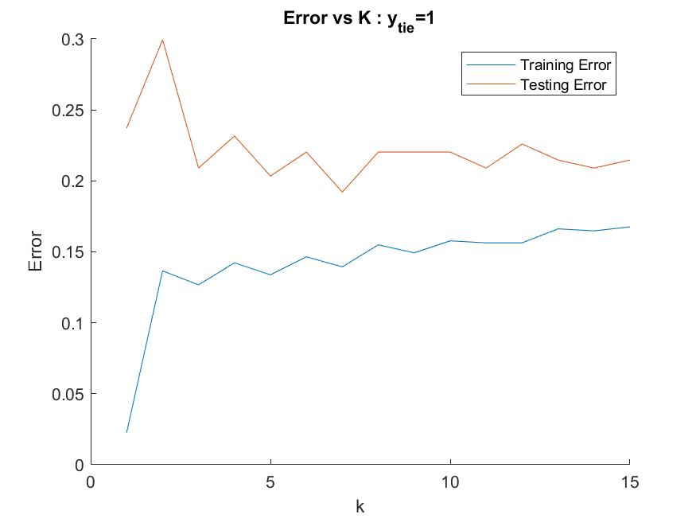
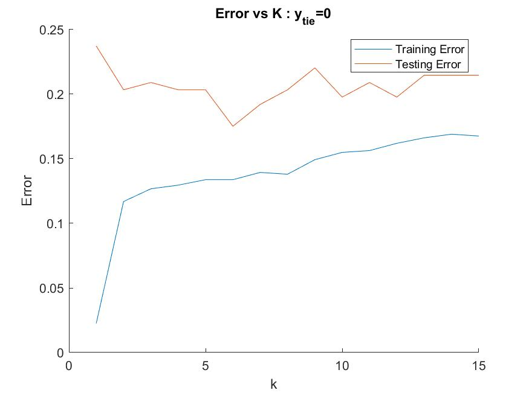
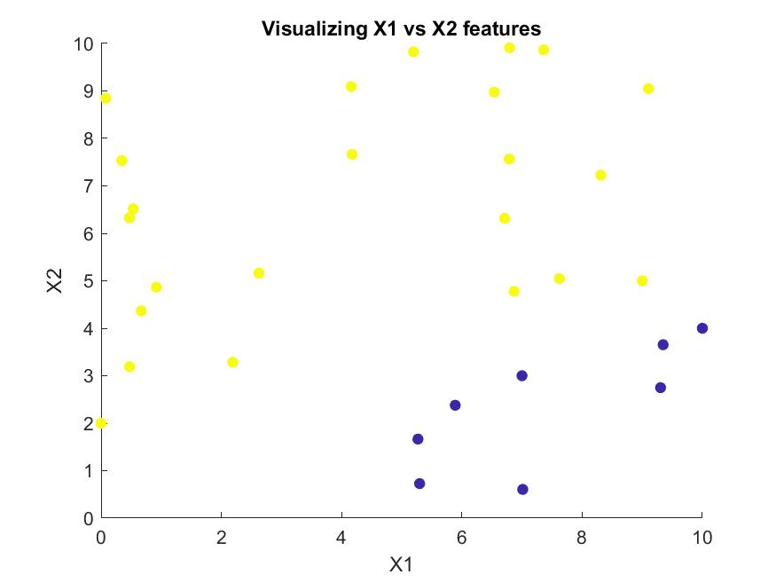
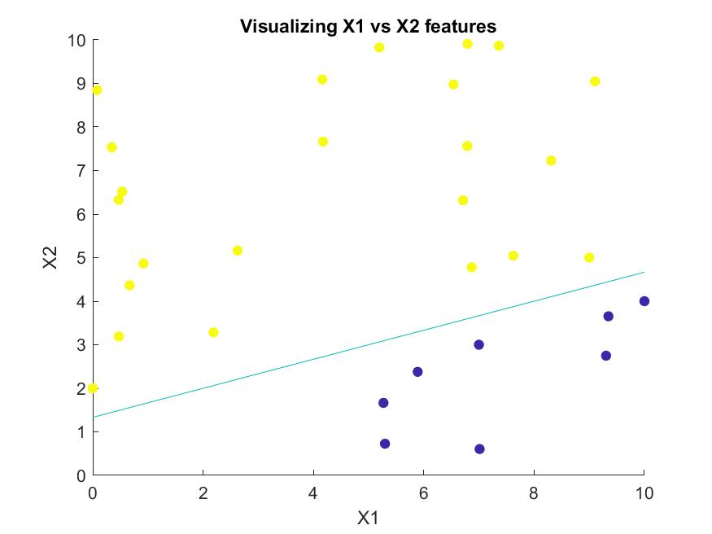
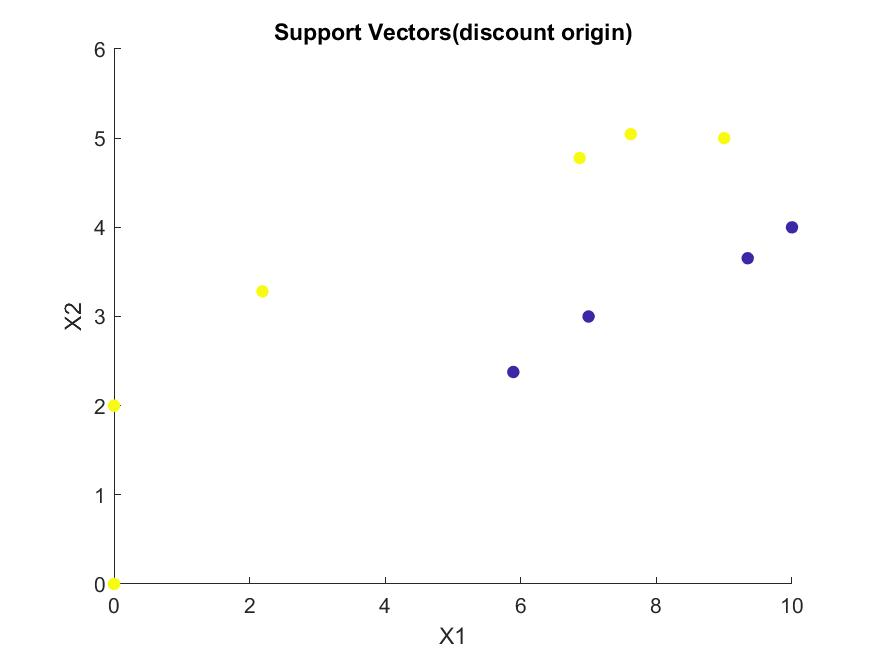
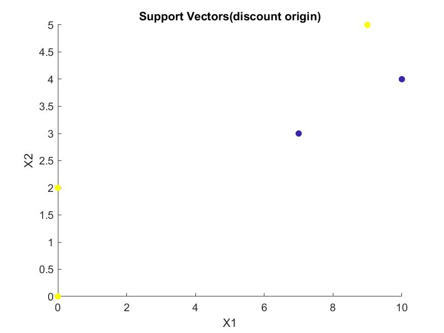

---
documentclass:
- article
geometry:
- top=1in
- left=1in
---

# MATLAB Portion for Homework 4

Note that there are two problems that require the use of matlab for this homework. As such this document will be broken down into a section detailing the code used for all problems and a results section displaying the results and giving responses where required for the problem. Note that the section for the code is labeled for which parts of the code correspond to which problem.

## MATLAB Code

The code for this homework is shown below:

```MATLAB
%% ECEM146 Homework 4
% Author: Thomas Kost
% date: 4/26/20
%%%%%%%%%%%%%%%%%%%%%%%%%%%%%%%%%%%%%%%%%%%%%%%%%%%%%%%%%%%%%%%%%5
clear, clc,close all;
%% 1 : KNN

train_x = dlmread('dataTraining_X.csv');
train_y = dlmread('dataTraining_Y.csv');
test_x  = dlmread('dataTesting_X.csv');
test_y  = dlmread('dataTesting_Y.csv');

test = classify_point_knn(test_x(1,:),train_x, train_y,2,1);
max_k =15;
%A
y_tie =1;
accuracy = zeros(2,max_k);
for k = 1:max_k
    predicted_training = knn_predict(train_x, train_x,train_y,k,y_tie);
    predicted_test     = knn_predict(test_x, train_x,train_y,k,y_tie);
    
    accuracy_training = sum(predicted_training==train_y')/length(train_y);
    accuracy_testing  = sum(predicted_test == test_y')/length(test_y);
    accuracy(1,k)=accuracy_training;
    accuracy(2,k)=accuracy_testing;
end
part_a_fig = figure(1);
hold on;
%plot errors
plot([1:max_k],1-accuracy(1,:));
plot([1:max_k],1-accuracy(2,:));
hold off;
legend ('Training Error', 'Testing Error');
title('Error vs K : y_{tie}=1');
xlabel('k');
ylabel('Error');
saveas(part_a_fig, '1_a.jpg');
%B
y_tie =0;
accuracy = zeros(2,max_k);
for k = 1:max_k
    predicted_training = knn_predict(train_x, train_x,train_y,k,y_tie);
    predicted_test     = knn_predict(test_x, train_x,train_y,k,y_tie);
    
    accuracy_training = sum(predicted_training==train_y')/length(train_y);
    accuracy_testing  = sum(predicted_test == test_y')/length(test_y);
    accuracy(1,k)=accuracy_training;
    accuracy(2,k)=accuracy_testing;
end
part_b_fig = figure(2);
hold on;
%plot errors
plot([1:max_k],1-accuracy(1,:));
plot([1:max_k],1-accuracy(2,:));
hold off;
legend ('Training Error', 'Testing Error');
title('Error vs K : y_{tie}=0');
xlabel('k');
ylabel('Error');
saveas(part_b_fig, '1_b.jpg');
%% 5:
data = dlmread('Data.csv');
x1 = data(:,1);
x2 = data(:,2);
y = data(:,3);
%A
data_visualization = figure(3);
scatter(x1,x2,[], y, 'filled');
xlabel('X1');
ylabel('X2');
title('Visualizing X1 vs X2 features');
%B
n = 2;

cvx_begin
    variables w(n) b
    minimize( 0.5*w'*w)
    subject to
        y.*(w(1)*x1+w(2)*x2+ b ) >= 1
        
cvx_end
fprintf ('This resulted in w = [%f,%f] and b = %f', w(1),w(2), b);

boundary = figure(4);
hold on;
scatter(x1,x2,[], y, 'filled');
xlabel('X1');
ylabel('X2');
title('Visualizing X1 vs X2 features');
f = @(x_1, x_2) b + w(1)*x_1 +w(2)*x_2;
fcontour(f,[0,10,0,10], 'LevelList',0);
hold off;
saveas(boundary, '5_b.jpg');
N = length(x1);
X = [x1,x2];
D = X*X';
P =X*X';
cvx_begin
    variable a(N)
    maximize (sum(a)-0.5*quad_form(a.*y,P))
    subject to
        a >= 0
        y'*a == 0
cvx_end
a_mended= a.*(a>1e-9);%difference here
x_1_mended = x1.*(a_mended~=0);

x_2_mended = x2.*(a_mended~=0);
y_mended = y.*(a_mended~=0);
figure5 = figure(5);
scatter(x_1_mended, x_2_mended, [], y, 'filled');
xlabel('X1');
ylabel('X2');
title('Support Vectors(discount origin)');
saveas(figure5, "5_c.jpg");


%% Functions for 1:
function y_predict = knn_predict(x_test,train_x, train_y, k, ytie)
    y_predict(1:length(x_test)) =0;
    for i = 1:length(x_test)
        y_predict(i) = classify_point_knn(x_test(i,:),train_x, train_y, k, ytie);
    end
end
function label = classify_point_knn (x,train_x, train_y, k, ytie)
    min_dist(1:k) = inf;
    min_index(1:k) = 0;
    
    for i =1:length(train_x)
        %calculate euclidian distance
        dist = norm(x-train_x(i,:));
        max_dist_recorded = max(min_dist);
        %if smaller distance, replace largest index
        %note if tie, the smaller index remains
        if max_dist_recorded > dist
            for j =1:k
                %if smaller than any of our recorded distances, record
                if(max_dist_recorded == min_dist(j))
                    min_dist(j) = dist;
                    min_index(j) = i;
                    break;
                end
           end
        end
    end
    
    %tally the results
    is_1 =0;
    is_0 =0;
    for n =1:k
        if(train_y(min_index(n)))%if 1
            is_1 = is_1+1;
        else
            is_0 = is_0 +1;
        end
    end
    
    %declare winner
    if(is_1 == is_0)
        label = ytie;
    elseif (is_1 < is_0)
        label = 0;%0 majority
    else
        label = 1;%1 majority
    end
end
```

## Results

### 1A

For the tiebreakers being set to 1, we found the following plot (Figure 1):



### 1B 
For the tiebreakers being set to 0, we found the following plot (Figure 2):



### 5A
Here we visualize the data provided. We can see that the data is linearly seperable as there is clearly a divide in which the data can be divided by class. The plot is shown in Figure 3.



### 5B
Here we plot the decision boundary found using a minimization of the primal problem through CVX. This resulted in the following output and the associated plot in Figure 4.
$$\text{This resulted in w = [-0.500000,1.500000] and b = -2.000000} $$



### 5C
Here we plotted the support vectors (discounting all points at the origin). We determined the values of the support vectors using the demarcation provided of any value below 1e-9 to be 0, and all above to be our non-zero $a_{i}'s$. Using this metric we can see there are 9 support vectors. However, the magnitude of the coefficents of many of these points are near our threshhold for 0. We can see in reality we have 4 support vectors of non-nearly-negligable vlues.

Using the 1e-9 demarcation we found the following plot of our support vectors (Figure 5).



The plot in Figure 6 shows the support vectors who are of appreciable value (well above threshold).

