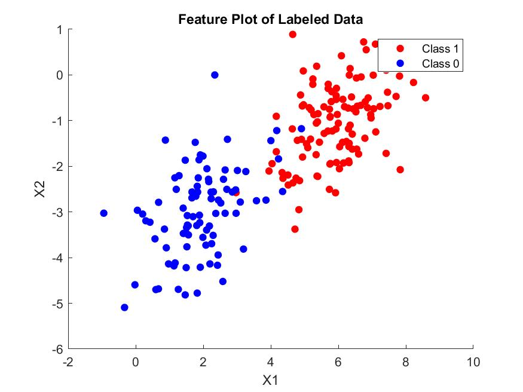
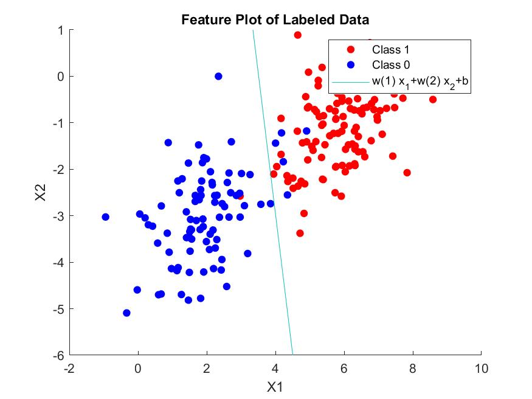

---
documentclass:
- article
geometry:
- top=1in
- left=1in
---

# ECEM146 Homework 6 MATLAB Portion

This document will be broken into two parts, a section with the relevant MATLAB code, and a sectoin providing all of the results, outputs, and necessary discussions. We should also note that for clarity, the code is annotated to show which portion of the code pertains to each part of question 5.

## Code

```MATLAB
%% ECEM146: Homework 6
%  Author: Thomas Kost
%  UID: 504989794
%  Date: 5/20/20
%%%%%%%%%%%%%%%%%%%%%%%%%%%%%%%%%%%%%%%%%%%%%%%%%%%%%%%%%%%%%%%%%%%%%%%%%%
clc, clear, close all;
%% 5:

data = load('data (1).csv');
%% 5A:
%  Plot data
x1 = data(:,1);
x2 = data(:,2);
y  = data(:,3);

class1_x1 = x1.*y;
rm = find(~class1_x1);
class1_x1(rm) = [];

class1_x2 = x2.*y;
rm = find(~class1_x2);
class1_x2(rm) = [];

class0_x1 = x1.*~y;
rm = find(~class0_x1);
class0_x1(rm) = [];

class0_x2 = x2.*~y;
rm = find(~class0_x2);
class0_x2(rm) = [];


vis = figure(1);
hold on;
scatter(class1_x1, class1_x2,[], 'r', 'filled');
scatter(class0_x1, class0_x2,[], 'b', 'filled');
hold off;
legend('Class 1', 'Class 0');
xlabel('X1');ylabel('X2'); title('Feature Plot of Labeled Data');
saveas(vis, 'vis.jpg');

%% 5B: Parameter Estimation
p1 = sum(y)/length(y);
p0 = 1-p1;
X = [x1,x2];

u0 = 0;
u1 = 0;
for i =1:length(X)
    u0 = u0 + X(i,:)*(~y(i));
    u1 = u1 +X(i,:)*(y(i));
end
u0 = u0/sum(~y);
u1 = u1/sum(y);
s1 = zeros(2,2);
s2 = zeros(2,2);
for i =1:length(X)
    s1 = s1 + (X(i,:)-u1)'*(X(i,:)-u1)*y(i);
    s2 = s2 + (X(i,:)-u0)'*(X(i,:)-u1)*(~y(i));
    
end
sigma = (s1+s2)/length(X);

%% 5C: 
%find decision boundary

w = (2*(u0-u1)/sigma)';
b = -(u0/sigma)*u0' +(u1/sigma)*u1' +2*log(p0/p1);

%% 5D:
dec_bound = figure(2);
hold on;
scatter(class1_x1, class1_x2,[], 'r', 'filled');
scatter(class0_x1, class0_x2,[], 'b', 'filled');
legend('Class 1', 'Class 0');
xlabel('X1');ylabel('X2'); title('Feature Plot of Labeled Data');
saveas(vis, 'vis.jpg');
hold off;

%plot line
hold on;
f = @(x1,x2) w(1)*x1 +w(2)*x2 + b;
fcontour(f,[-2 10 -6 1],'LevelList', 0);
hold off;
saveas(dec_bound, 'decision_boundary.jpg');
```

## Results

### 5A

The visualization of our data is shown in the plot in Figure 1. We can see that class 0 and class 1 each have a relatively distinct grouping, but that the data is not acutally linearly seperable. Luckily, we are able to handle a non-linearly seperable data set with Gaussian Discriminant Analysis.



### 5B

In this part we are asked to perform the parameter estimation needed to find the probability a label is 0, the mean of each class, and the covariance matrix (assuming it is the same between the two classes). We find the following results:
$$ \mu_{0} = \begin{bmatrix} 1.9195  \\ -2.9972 \end{bmatrix}$$
$$ \mu_{1} = \begin{bmatrix} 5.8982 \\ -1.0793 \end{bmatrix}$$
$$ P (y=0) = 0.4450 $$
$$ P (y=1) = 0.5550 $$
$$ \Sigma = \begin{bmatrix} 1.0181 & 0.3887   \\ 0.3887 & 0.8036 \end{bmatrix}$$

### 5C

In this part we are asked to find the values of w and b using our parameter estimation in the previous problem.  We will use the formula derived in problem 3 to achieve this result. The resulting values of the decision boundary are shown below:

$$ w = \begin{bmatrix} -7.3511 \\ -1.2180 \end{bmatrix}$$
$$ b = 25.81 $$

### 5D

In this final part we plot our decision boundary found in 5C. This plot is shown in Figure 2. We can see here that the decision boundary appears to pass through the point where the two distributions have equal probability. This is because we assumed both the distributions to be gaussian and used a generative modeling technique. As our goal was to model the boundary based upon the probabalistic model of the classes, the decision boundary will be the point where it is equally likely for a data point to be from either class. We can see this as the decision boundary overlaps the portion of the classes that intersect one another. This midpoint that divides the classes (approximately) is the linear boundary that our constraints find.


