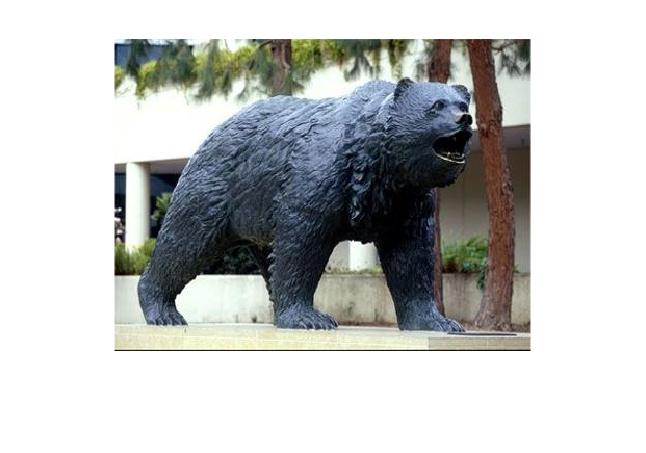
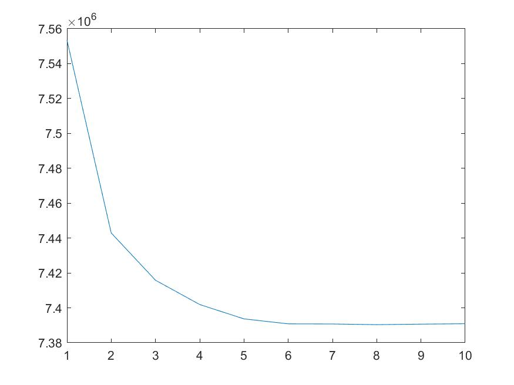
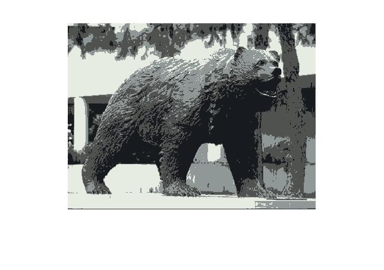
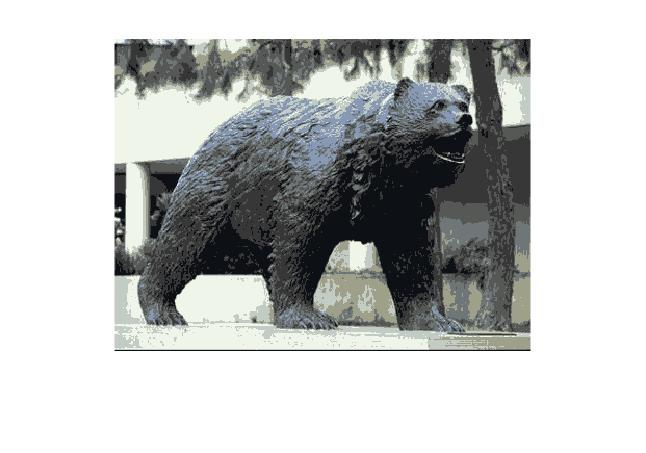
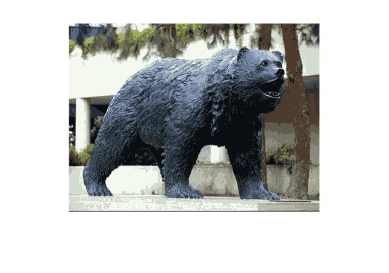

---
documentclass:
- article
geometry:
- top=1in
- left=1in
---

# ECEM146 Homework 7 Problem 5

 Note that this document will be broken into two major sections--one section with the MATLAB code that was written to solve the problem, and one section showing and detailing the results of the code.

# Code

 This seciton contains all the code that was written for the problem. Note that the code is annotated to show which section of the code corresponds to each question. All functions are declared at the bottom of the script.
```MATLAB
%% ECEM146: Homework 7
%  Author: Thomas Kost
%  UID: 504989794
%  Date: 5/27/20
%%%%%%%%%%%%%%%%%%%%%%%%%%%%%%%%%%%%%%%%%%%%%%%%%%%%%%%%%%%%%%%%%%%%%%%%%%%
clear, clc, close all;
%% 5a:
sweaty_bruin = imread('UCLA_Bruin.jpg');
fig1 = figure(1);
imshow(sweaty_bruin);
%% 5b:
itterations = 10;
linear_sweaty_bruin = reshape(sweaty_bruin,[120000,3]);
final = reshape(linear_sweaty_bruin, [300,400,3]);
imshow(final)

[im,J] = kmeans(4,sweaty_bruin, itterations, 0);
fig2 = figure(2);
plot(J);

%% 5c:
k = [4,8,16];
fig3= figure(3);
fig4 = figure(4);
fig5 = figure(5);
for i= 1:length(k)
    [im,J] = kmeans(k(i),sweaty_bruin, itterations, 1);
    figure(2+i);
    imshow(cast(im,'uint8'));
end


%  save images
saveas(fig1, "original.jpg");
saveas(fig2, "objective_plot.jpg");
saveas(fig3, "4means.jpg");
saveas(fig4, "8means.jpg");
saveas(fig5, "16means.jpg");

%% Functions
%  usage:
%  [compressed_image,J] = kmeans(k, original_image, itterations)
function [result,J] = kmeans(K, image, itterations, compress)
means = zeros(3,K);% mean and index
index = zeros(1,K);
[l,w,d] = size(image);
linearized_im = reshape(image, [l*w, d]);
[means, index] = initialize(means, index, linearized_im);
J(1:itterations)=0;
assignments = zeros(length(linearized_im),1);

for i=1: itterations;
    assignments = assign(means, linearized_im);%step 1
    means = reestimate(assignments, linearized_im,K);
    %calculate J(i)
    if(~compress)
       for n=1:length(linearized_im)
         for k=1:K
             J(i) = J(i) + (assignments(n)==k)*norm(double(linearized_im(n,:))-means(:,k));
         end
       end
    end
end
%compress or not
if (compress)
    for n=1:length(linearized_im)
         for k=1:K
             J(1) = J(1) + (assignments(n)==k)*norm(double(linearized_im(n,:))-means(:,k));
         end
    end
    fprintf("Final value of Objective Function: %d\n",J(1));
    vals = floor(means);
    im_comp = zeros(size(linearized_im));
    for m=1:length(im_comp)
        im_comp(m,:)= vals(:,assignments(m));
    end
    result = reshape(im_comp, [l,w,d]);
else
    result =image;
end
end

function [initialized_means, indexes] = initialize(means,index, linearized_im)
random_pixel = [229;249;250];
means(:,1) = random_pixel;
index(1) =0;
for i= 2:length(means)
    dist(1:4,1) = inf;
    max_value = zeros(3,1);
    max_min_dist = 0;
    max_index =1;
    for j =1: length(linearized_im)
        for k =1: length(means)-1
            dist(k) = norm(double(linearized_im(j,:))-means(:,k));
        end
        %only want to consider the first i-1 values
        closest_dist = min(dist(1:i-1));
        if (closest_dist > max_min_dist)
            %if closest point is furthest recorded from prototypes
            max_min_dist = closest_dist;
            max_index = j;
            max_value = linearized_im(j,:);
        end
    end
    means(:,i) = max_value;
    index(i) = max_index;
end
initialized_means = means;
indexes =index;
end
function assigned_clusters = assign(means, linearized_im)
assigned_clusters = zeros(length(linearized_im),1);
for i=1: length(linearized_im)
    %calculate each distance
       dist(1:length(means)) =0;
       for k=1:length(means)
            dist(k)= norm(double(linearized_im(i,:))'-means(:,k));
       end
       val = min(dist);
       assigned_clusters(i) = find(val==dist,1);
end
end
function new_means = reestimate(assignments, linearized_im,K)
new_means = zeros(3,K);
for i=1: K
    count=0;
    sum=0;
    for j=1:length(linearized_im)
        count = count + (assignments(j)==i);
        sum = sum + (assignments(j)==i)*double(linearized_im(j,:));
    end
    new_means(:,i) = (sum/count)';
end
end
```

# Results

## 5a
In this question we were asked to visualize the image, this was done through tht imread and imshow functions. The resulting image was the original image provided and is shown in Figure 1. 



## 5b

In this question we were asked to implement the Kmeans algorithm for a given starting condition and K=4. This was done in the kmeans function. Note that the initialization function takes care of all initialization, and as a result can be customized for specific initialization methods. Additionally, the function takes the value of K desired and thus can be used for different values of K. The plotting of the objective function for K=4 over 10 itterations is shown in Figure 2. We can notice that this plot starts at a very high value for the function and decreases in an exponential like curve by itteration. We can notice that the function saturates at about 7400000. This shows that the function converges to a single value by 10 itterations as it is relatively constant over the last few itterations. 



## 5c
In this question we were asked to run the K-means algorithm for K=4,8,16. The final value of the objective function for each value respectively is shown below:

$$\text{Final value of Objective Function for K=4: 7.390897e+06}$$
$$\text{Final value of Objective Function: 5.586240e+06}$$
$$\text{Final value of Objective Function: 5.302426e+06}$$

The compression was then applied to the image, and the resulting image was shown. The images resulting from this are showin in Figure 3, Figure 4, and Figure 5. We can notice that the quality of Images improves for larger values of k. We can specifically relate this improvement to the number of colors present in the image. As k increases we closer approach the original image in quality.







## 5d

We no longer need the same number of bits to represent these compressed images. As the original image requires 960000 bits for the image the following breaks downthe bits required for each kmeans compression and the resulting compression rate:
$$\text{For k=4: 240032 bits, r = 3.9995}$$
$$\text{For k=8: 360064 bits, r = 2.66625}$$
$$\text{For k=16: 480128 bits, r = 1.9995}$$
