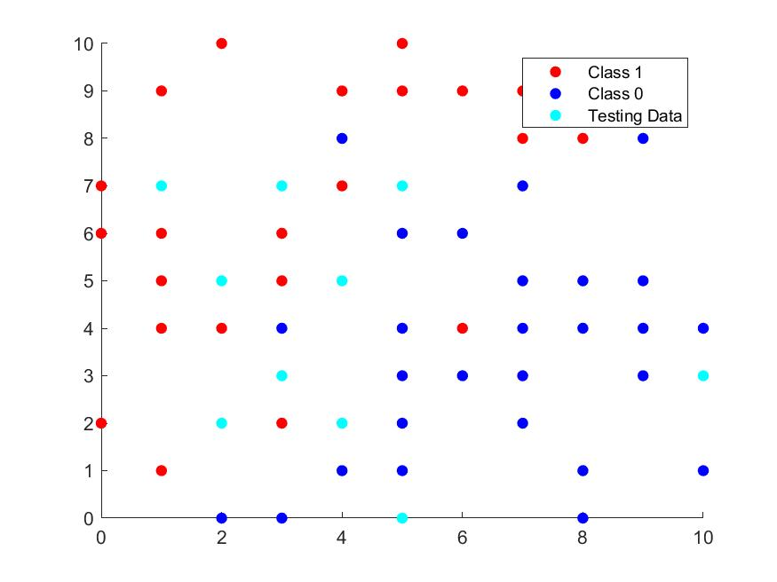
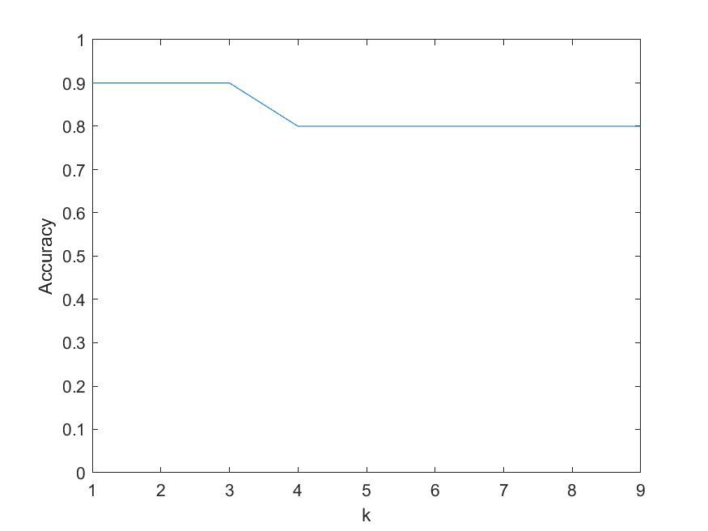

---
documentclass:
- article
geometry:
- top=1in
- left=1in
---

# Question 2

Note that this document is broken down by a section containing the code and a section containing the results. Any written answers for this question will be contained in the results section along with the corresponding graphs.

## Code

```MATLAB
%% ECEM146 Midterm
% Author: Thomas Kost
% UID: 504989794
% Date: 5/4/2020
%%%%%%%%%%%%%%%%%%%%%%%%%%%%%%%%%%%%%%%%%%%%%%%%%%%%%%%%%%%%%%%%%%%%%%%%%%%
clear, clc, close all;
%% P2:
data = dlmread('Q2data.csv');

%figure(3);
%scatter(data(:,1),data(:,2),[], data(:,3), 'filled');

%break into training and testing data
alpha = 5;
test_data = data(10*(alpha-1)+1:10*alpha,:);
training_data_1 = data(1:10*(alpha-1),:);
training_data_2 = data(10*alpha+1:end,:);
training_data = [training_data_1' training_data_2']';

%break into classes for plotting 
class1 = zeros(sum(training_data(:,3)),2);
j=1;
for i = 1: length(training_data)
    
    if(training_data(i,3) == 1)
        class1(j,:) = training_data(i,1:2);
        j = j+1;
    end
end

class0 = zeros(length(training_data)-sum(training_data(:,3)),2);
j=1;
for i = 1: length(training_data)
    if(training_data(i,3) == 0)
        class0(j,:) = training_data(i,1:2);
        j = j+1;
    end
end
%% 2A:
%plot
fig1 = figure(1);
hold on;
scatter(class1(:,1), class1(:,2), [], 'red', 'filled');
scatter(class0(:,1), class0(:,2), [], 'blue', 'filled');
scatter(test_data(:, 1), test_data(:, 2), [], 'cyan', 'filled');
hold off;
legend('Class 1', 'Class 0', 'Testing Data');

%% 2B:
training_data_features = training_data(:,1:2);
training_data_labels = training_data(:,3);

testing_features = test_data(:,1:2);
testing_labels = test_data(:, 3);
predict_accuracy = zeros(9,1);
for k=1:9
prediction = knn_predict(testing_features, training_data_features, training_data_labels, k);
predict_accuracy(k) = accuracy(prediction, testing_labels);
end
fig2 = figure(2);
plot(predict_accuracy)
ylim([0,1]);
xlabel('k');
ylabel('Accuracy');
%% KNN 
function acc = accuracy(prediction, test_labels)
    acc = sum(prediction'==test_labels)/length(test_labels);
end
function prediction = knn_predict(x_test,train_x, train_y, k)
    prediction(1:length(x_test)) =0;
    for i = 1:length(x_test)
        prediction(i) = classify_point_knn(x_test(i,:),train_x, train_y, k);
    end
end

function label = classify_point_knn (x,train_x, train_y, k)
    min_dist(1:k) = inf; %set all to inf
    min_index(1:k) = 0;
    
    for i =1:length(train_x)
        %calculate L1 Norm as distance
        dist = norm(x-train_x(i,:),1);
        max_dist_recorded = max(min_dist);
        %if smaller distance, replace largest index
        %note if tie, the smaller index remains as only replaces if
        %strictly greater than
        if max_dist_recorded > dist
            for j =1:k
                %if smaller than any of our recorded distances, record
                if(max_dist_recorded == min_dist(j))
                    min_dist(j) = dist;
                    min_index(j) = i;
                    break;
                end
           end
        end
    end
    
    %tally the results
    is_1 =0;
    is_0 =0;
    for n =1:k
        if(train_y(min_index(n)))%if 1
            is_1 = is_1+1;
        else
            is_0 = is_0 +1;
        end
    end
    
    %declare winner
    if(is_1 == is_0)
        label = 0;
    elseif (is_1 < is_0)
        label = 0;%0 majority
    else
        label = 1;%1 majority
    end
```
## Results

### 2A

The data is plotted and labeled in Figure 1. As we can see from the plot, the data is not linearly seperable.



### 2B

Figure 2 shows the plot of different values of k against the accuracy produced by each model.
 
